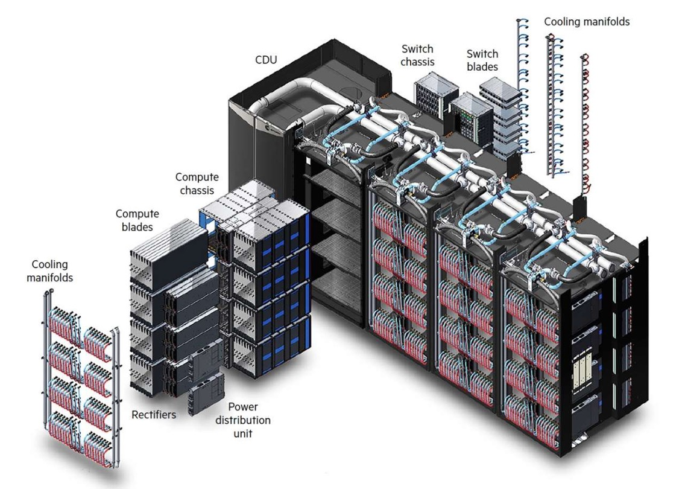
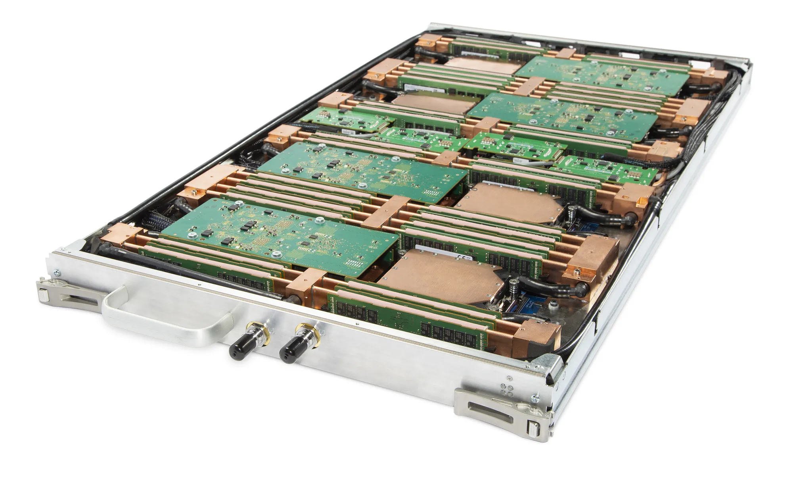
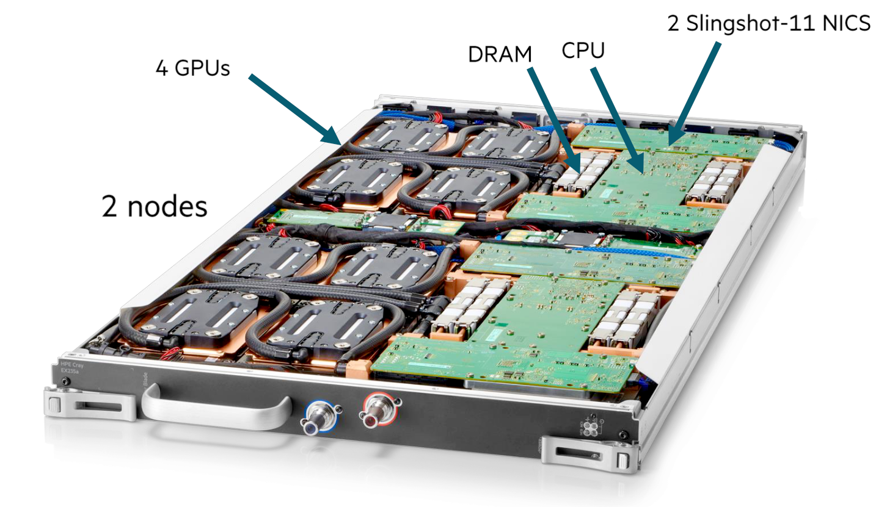
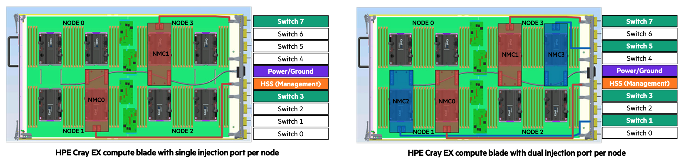

# Building up the supercomputer

## A real supercomputer: The HPE Cray EX

The HPE Cray EX architecture is currently (2023-2024) used for some of the
biggest supercomputers in the world, including the 3 first US exascale systems Frontier, Aurora and El Capitan,
but also several other large supercomputers in the USA, and the European pre-exascae system LUMI.

*Structure of the Cray EX supercomputer*

Let's now have a look at how everything connects together to the European pre-exascale 
supercomputer LUMI. LUMI has two types of compute nodes:

-   CPU-only nodes have 2 64-core AMD EPYC processors with 256 GB, 512 GB or 1 TB of RAM,
    and one Slingshot 11 interconnect port. Slingshot 11 is an interconnect designed by
    HPE Cray and very well suited for both small and very large machines. This section
    of the computer is also called LUMI-C.
-   Nodes with 1 64-core AMD CPU and 4 AMD MI250X GPUs. This node type will also be
    discussed later in these lecture notes when discussing accelerators.
    Each GPU has 128 GB of very high bandwidth memory, and the CPU connects to 512 GB
    of RAM, bringing the total to 1 TB of RAM memory per node. Each node also has 
    4 Slingshot 11 ports. This section of the computer is also called LUMI-G.

The Cray EX architecture does use a custom rack design for the compute nodes that is also fully water cooled.
It is designed for maximum density to keep connections in the machine as short as possible.
It is build out of units that can contain up to 4 custom cabinets, and a cooling distribution
unit (CDU). The size of the complex as depicted in the picture is approximately 12 m2.
Each cabinet contains 8 compute chassis in 2 columns of 4 rows. In between the two
columns is all the power circuitry. Each compute chassis can contain 8 compute blades
that are mounted vertically. Each compute blade can contain multiple nodes, depending on
the type of compute blades. HPE Cray have multiple types of compute nodes, also with 
different types of GPUs. In fact, the Aurora supercomputer which uses Intel CPUs and GPUs and
El Capitan, which uses the MI300 series of APU (integrated CPU and GPU) will use the same
design with a different compute blade. 

Each LUMI-C compute blade contains 4 compute nodes
and two network interface cards, with each network interface card implementing two Slingshot
interfaces and connecting to two nodes. The picture below shows a very similar node,
but with 4 network cards each providing 2 network connections rather than 2 such cards.
On LUMI, only the middle ones are present.

*Blade with 4 CPU nodes and 8 Slingshot ports*

At the front of this blade there are two connections to for the water cooling. The 
network connections are on the back but are not visible in this picture.

A LUMI-G compute blade contains two nodes and
4 network interface cards, where each interface card now connects to two GPUs in the same 
node. All connections for power, management network and high performance interconnect
of the compute node are at the back of the compute blade. At the front of the compute
blades one can find the connections to the cooling manifolds that distribute cooling
water to the blades. One compute blade of LUMI-G can consume up to 5kW, so the power
density of this setup is incredible, with 40 kW for a single compute chassis.

*Blade with 2 MI250x GPU nodes and 8 Slingshot ports*

The back of each cabinet is equally genius. At the back each cabinet has 8 switch chassis,
each matching the position of a compute chassis. The switch chassis contains the connection to
the power delivery system and a switch for the management network and has 8 positions for 
switch blades. These are mounted horizontally and connect directly to the compute blades.
Each slingshot switch blade has 8x2 ports on the inner side for that purpose, two for each compute
blade. 

The picture below shows a Slingshot switch blade, with the side facing the compute blades
at the front. It has 8 square connectors, one each to each compute blade, but each connector
carries two Slingshot connections. The connectors on both sides are for power and monitoring.

*Switch blade, side facing the compute blades, with 8 double ports*

The next picture shows the outward facing side of the switch blade. There are 24
electrical connectors, but each again carries two Slingshot links. At the far left
and far right you can again note the connectors to the water cooling. Each switch
itself can consume up to 250W and also needs proper cooling.

*Switch blade, outward facing side*

As each switch blade carries two ports per compute blade,
for LUMI-C two switch blades are needed in each switch chassis as each blade has
4 network interfaces, and for LUMI-G 4 switch blades are needed for each compute chassis as
those nodes have 8 network interfaces. Note that this also implies that the nodes on the same 
compute blade of LUMI-C will be on two different switches even though in the node numbering they
are numbered consecutively. For LUMI-G both nodes on a blade will be on a different pair of switches 
and each node is connected to two switches. Thw switch blades are also water cooled (each one can 
consume up to 250W). No current possible configuration of the Cray EX system needs that much switches.

The picture below gives an impression of how this works for blades with 4 CPU nodes with 1 (left) or
2 (right) connections to the Slingshot interconnect.

The left picture is not completely right as the interface coming from NMC0 should not connect to the HSS
port but to the Switch 3 port. In these pictures, each node has two CPUs and those CPUs are next to each 
other, not on top of each other, so the nodes are arranged in a 2x2 grid. Between each node pair there are
4 PCIe connectors, 2 of wich connect to the upper node and 2 of which to the lower node. NMC0 and NMC1 are
the Slingshot network cards, and each has 2 PCIe connections that go to connectors that connect to 
different nodes. In the left picture, with one Slingshot connection per compute node, node 0 and 1 connect
to the switch in slot 3 while node 2 and 3 connect to the switch in node 7. In the right picture, with one
Slingshot connection per CPU or two per node, Node 0 and 1 both connect to two switches, the ones in slot 3 and slot 1,
while node 2 and 3 also both connect to two switches, the ones in slots 5 and 7. This setup gives each CPU
direct access to the interconnect without interfering with the other CPU in the node.

There are still free positions in the switch chassis as there is currently no node type that had more than
8 network ports per blade. These could still be useful in the future though. If not for an interconnect,
one could, e.g., export PCIe ports to the back and attach, e.g., PCIe-based storage via blades as the 
switch blade environment is certainly less hostile to such storage than the very dense and very hot
compute blades.
