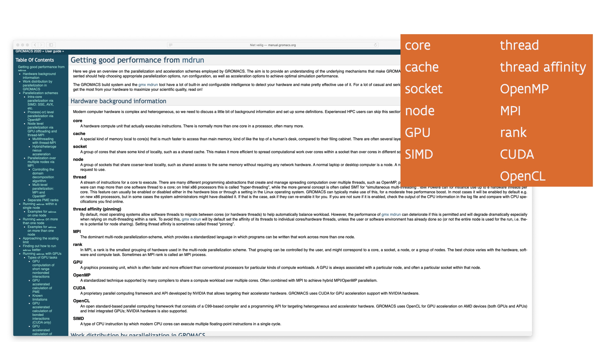
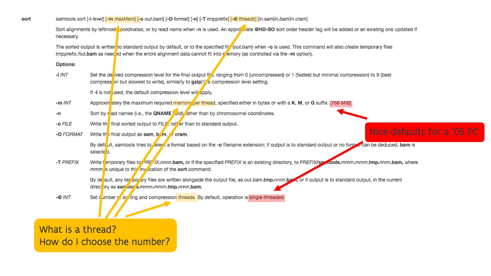
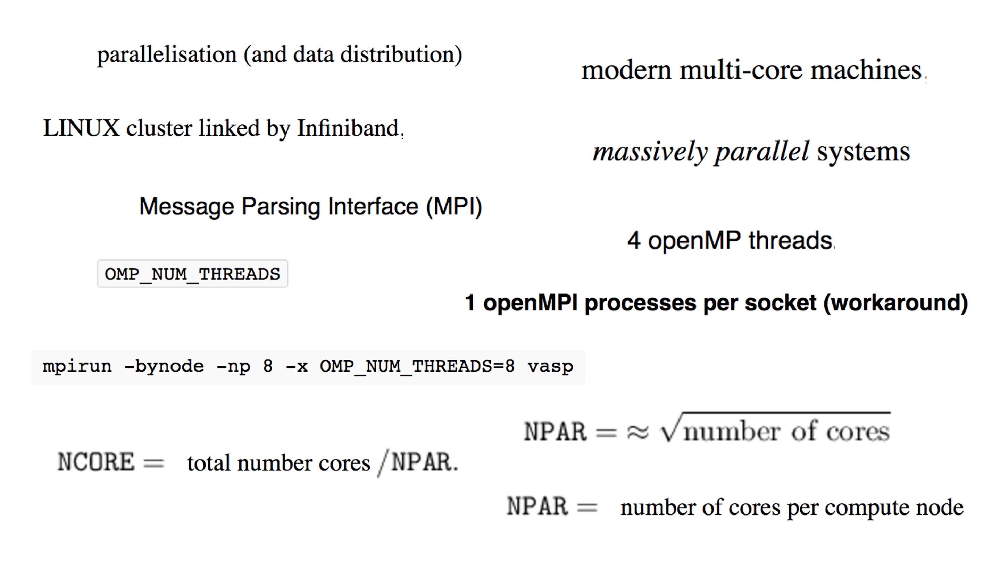

# Goals

The goals of these lecture notes are that at the end, the reader should be able to answer
questions such as:

-   Why would I consider using a supercomputer?

-   How does supercomputer hardware influence my choice of software or programming techniques?
    And is this only so for supercomputers or does it actually also affect other compute devices
    such as a regular PC, a tablet or a smartphone?

-   What can and can we not expect from a supercomputer?

The reader may be very much tempted to say **"I'm not a programmer, do I need to know all this?"**
but one should realise a supercomputer is a very expensive machine and a large research infrastructure
that should be used efficiently unless a cheap PC or smartphone. Whether a supercomputer will be used well
depends on the problem you're trying to solve and on your choice of software. 
It also depends on the resources that you request when starting a program.
Unlike your PC, a supercomputer is a large shared infrastructure and you have to specify which part of the
computer you need for your computations. This requires an understanding of the supercomputer that
you are using, the needs of the software you're using and the problem you're trying to solve. 
In fact, if the software cannot sufficiently well
exploit the hardware of the supercomputer, or if your problem is too small,
you should be using a different type of computing such as simply
a more powerful PC, or in some cases a cloud workstation.

Another goal is also to make it very clear that a supercomputer is not a superscaled PC that does
everything in a magical way much faster than a PC.

Some inspiration for these lecture notes comes from looking at the manuals of some software packages that
users of the CalcUA infrastructure use or have used, including CP2K, OpenMX, QuantumESPRESSO, Gromacs and SAMtools,
and checking which terminology those packages use. In fact, the GROMACS manual even contains a section that tries 
to explain in short many of the terms (and even some more) that we discuss in these notes.

The above figure shows an extract from the GROMACS manual with a lot of terms that one needs to know
to tune the parameters of the GROMACS ``mdrun`` command for good performance. Most of these will be covered
in these lecture nodes.

Next, let's have a look at the manual page of the SAMtools ``sort`` command.

Note that the SAMtools ``sort`` command has parameters to specify the maximum amount of memory that it should
use and the number of threads. Hence the user should have an idea of how much memory can be realistically used,
what a thread is and how one should chose that number. That does require knowledge of the working of the SAMtools
``sort`` command which is domain-specific help desk that only a help desk specialised in bio-informatics tools
could help you with, but it also requires knowing what a thread is and what it is used for. You can't rely on
the defaults as these are 768 MB for memory and a single thread, which are very nice defaults for a decent PC
in 2005, but not for a supercomputer in 2023 (or not even a PC in 2023).

Finally, the next picture shows a number of terms copied from a VASP manual

The reader is confronted with a lot of technical terms that they need to understand to use VASP in a sufficiently
optimal way. In fact, a VASP run may even fail if the parameters used in the simulations do not correspond 
to the properties of the hardware used for the run. 

In general, running software on a supercomputer is not at all as transparent as it is on a PC, and there are many
reasons for that. Some of the complexity comes from the fact that a supercomputer is shared among users and hence 
needs a system to allocate capacity to users. To keep the usage efficient, most of the work on a supercomputer is 
done through a so-called batch service where a user must write a (Linux/bash) script (a small program by itself) to
tell to the scheduler of the supercomputer what hardware is needed and how to run the job. After all, one cannot 
afford to let a full multi-million-EURO machine wait for user input. Part of the complexity comes also from the fact
that on one hand the hardware is much more complex than on a regular PC, so that it is harder for software to adapt
automatically, while on the other hand developers of packages typically don't have the resources to develop tools that 
would let programs auto-optimize their resource use to the available hardware. No user is willing to pay the amounts of
money that is needed to develop software that way. In fact, much of the applications used on supercomputers is 
"research-quality" code that really requires some understanding of the code and algorithms to use properly.
