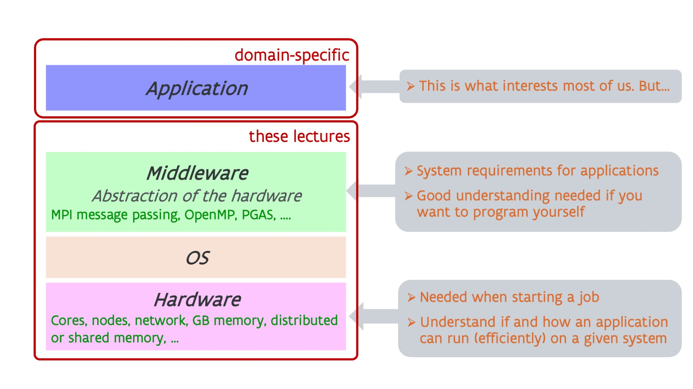

# Overview of the notes

## A supercomputer is a parallel computer

A supercomputer is not a superscaled PC that runs regular PC software much faster,
but it is a parallel computer:

-   In a supercomputer, many processors work together to create a fast system, and this is even multi-level
    parallelism. We will discuss this in the [section on Processors](../C02_Processors/index.md).

-   The memory of a supercomputer is also organised in a hierarchy: from fast buffer memory close
    to the processor to slower memory and then all the way to slow disks. Most of this
    will be explained in the [section on the memory hierarchy](../C03_Memory/index.md).

-   The permanent storage system of a supercomputer consists of many hard disks and solid state
    drives that are combined to a powerful storage system with the help of software. This is 
    explained in the [section on storage for supercomputers](../C04_Storage/index.md).

In the current state of technology this is far from transparent. It may be mostly transparent
for correctness of the program but it is not al all for performance, which is why one needs 
properly written software adapted to the specific properties of supercomputers. After all,
supercomputing is not about trying to upscale a PC equally in all parameters as that is
uneconomical and mostly physically impossible, but it is about building hardware as economical
as possible (as the market is too small to develop many non-standard components) and using
software to bind all hardware together to a very powerful machine.

Yet much of what you learn about supercomputers is also useful for programming PC's. Modern
PC's also increasingly rely on parallelism, and this has become very visible with the AMD
Ryzen-based PC's and the 12th Gen and later Intel processors. In fact, smartphones arrived
there even earlier as 8-core Android smartphones have been around since 2013.
PC's also have most of the memory hierarchy that you'll find in supercomputers, and taking
that hierarchy into account when writing software is as important for PC's as it is for
supercomputers. Even the inner workings of a solid state drive has elements in common with
how supercomputer storage work, and understanding the behaviour of supercomputer storage 
helps you also understand why an SSD will not always show the expected peak performance
claimed in the specifications.

## A supercomputer has a layered architecture

A supercomputer is much more than some hardware on which you run your application. As already
suggested above, between the hardware and your applications sits a lot of other software that
binds the hardware into a usable supercomputer. At the lowest level you have the operating system
which may be just linux but sometimes is a modified version of linux with some features disabled that
may harm the performance of a supercomputer and are not needed by real supercomputer applications.
But on a supercomputer there is a lot of other software that sits between the hardware and basic OS
on one hand and your application on the other hand. That software is often called *middleware*.

Most readers of these notes may be only interested in the applications they want to run.
However, some understanding of the hardware is needed even for simple things as starting a job,
as a supercomputer is a multi-user machine and you need to ask exactly what you need to be able
to run your application efficiently. 
And not all software can run efficiently on all hardware, or even run at all. 
But it also requires some understanding of the middleware. Your application, if it is really 
developed to use supercomputers properly, will also use some of that middleware, and not all 
middleware can be supported on all supercomputers.

For developers even better hardware knowledge is required to understand how to write programs
efficiently, and you also need a good understanding of the middleware that will be used to develop
your program.

The sections on [processors](../C02_Processors/index.md), [memory hierarchy](../C03_Memory/index.md)
and [storage](../C04_Storage/index.md) discuss the hardware of a supercomputer.
The [section on middleware](../C06_Middleware/index.md) then gives an overview of the most popular
middleware used to develop software that exploits parallelism. 
We cannot discuss much about the application layer in these notes, as that quickly becomes too
domain-specific, but we will discuss [what you can expect from a supercomputer](../C07_Expectations/index.md).

In recent years, accelerators have also become a hot topic. As the cost, both the investment cost
and energy cost, of supercomputers that are fully based on general-purpose hardware has become
too high to sustain the growth of compute capacity, scientists have turned into other technologies,
collectively known as accelerators, to further increase the performance at a lower investment and
energy cost, but losing some of the easy-of-use and versatility of general purpose hardware.
The most important types of compute accelerators and their programming models (and corresponding
middleware) will be discussed in the [section on accelerators](../C08_Accelerators/index.md).
