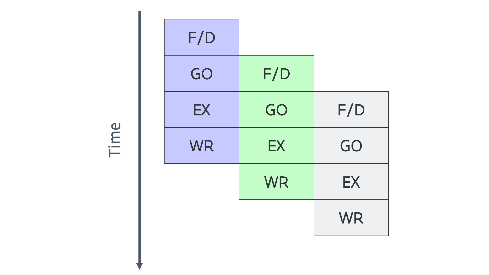

---
tags:
-   pipelined execution
-   ILP (Instruction Level Parallelism)
---

# Instruction level parallelism 1: Pipelining

Since different steps in the instruction execution process use different parts 
of the logic on the chip, one could try to overlap the execution of different
steps of different instructions. You can compare this with the way a car assembly
line works: cars being assembled move from one station to the next one
while the next car to be produced already follows as soon as a station is free.

In this simple model we can now start or complete (called retire) one 
instruction ever clock cycle, so we can process 4 times as many instructions
as in the previous case. This however requires that the next instruction 
is completely independent from the previous one. If one instruction uses
the result of a previous instruction, it has to wait until that instruction
as completed. This is called a bubble in the pipeline. So in practice we 
will never get one instruction per clock cycle with this design as it 
is usually impossible to have enough independent instructions in between
two dependent instructions. 

This is also the first example of so-called **instruction-level parallelism**:
The processor is working on multiple instructions simultaneously.
Pipelining has been used in processors for PC's since the mid '80s,
with the Intel i386 and i486 the first Intel CPUs to implement some 
form of pipelining. The i386 (also known as 80386), launched in 1985, 
could not even execute 1 instruction per clock in theory, but the i486 
(also known as the 80486) which launched in 1989 implemented pipelining more
or less as described here.

In supercomputers and other very large computers, pipelining appeared already
much earlier. The IBM System/360 Model 1 from 1964 and the
CDC 7600 (Control Data Corporation) from 1967 were some of the first examples.
(One of the co-founders of CDC was Seymour Cray who later started another 
company, Cray Research, the manufacturer of the Cray 1 mentioned in the previous
section.)
