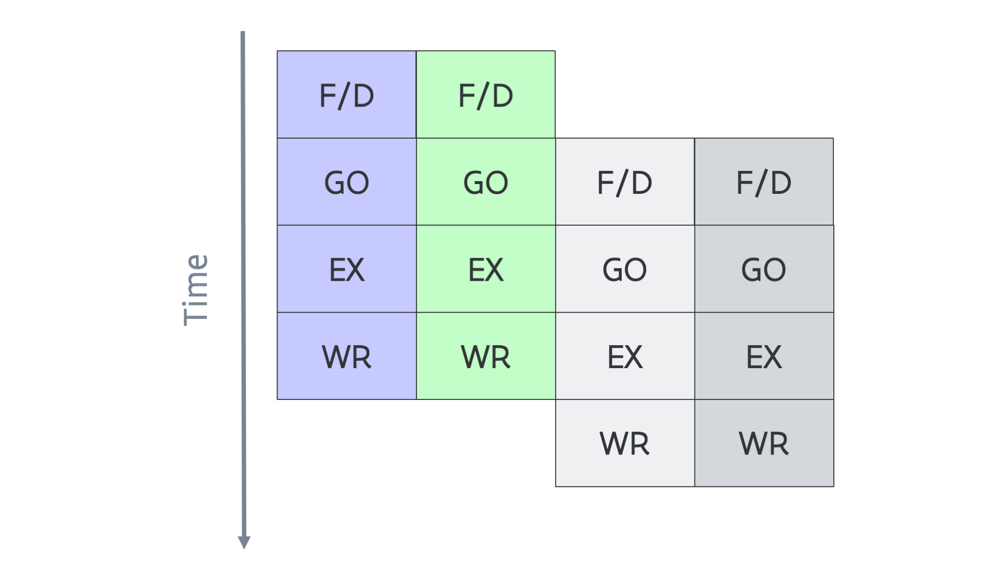

# Instruction level parallelism 2: Superscalar processing

A second way to improve the instruction throughput in a processor is to simply
increase the number of ALU and load-store/address generation units.
Of course this only makes sense if the instruction decoder in the control unit
is also enhanced so that it can also decode multiple instructions simultaneously
to keep those instruction units fed. This is called *superscalar execution* 
and is also a form of instruction level parallelism.

Combined with pipelining we would get the following scheme for execution instruction
(for the case where we could decode and execute two instructions simultaneously):

<figure markdown>
  
  <caption>Pipelined superscalar execution</caption>
</figure>

Of course this only works if there are enough independent instructions to execute.

With superscalar execution, and certainly when combined with pipelining, we have the
potential to execute more than one instruction per clock cycle. 

It also creates another opportunity: Specialised ALUs. Modern processors will have specialised
ALUs for integer instructions and for floating point instructions, and in fact, some of those
units may only be capable of executing some of those integer or floating point instructions.

In personal computers this technology appeared in the '90s. 
The Intel Pentium processor launched in 1993 implements a pipelined superscalar architecture
pretty much as on this slide, but both pipelines are not created equal and the compiler
had a lot of work to do to keep both pipelines used well.
The Pentium Pro, launched in 1995, introduced out-of-order execution: The processor could
re-order instructions for execution as it sees fit to get higher instruction throughput,
but does so in a way that at the end of the execution the result is the same as if the
instructions were executed in-order (also taking into account error conditions etc.)
This strategy is currently used by all modern high performance processors, and even by a
lot of low power processors. E.g., both the performance and efficiency cores in the 
12th and 13th gen processors code named Alder Lake and Raptor Lake
are out-of-order pipelined superscalar processor cores. The ARM Cortex-A53 and Cortex-A55 processors
that are often used as the efficiency cores in Android mobile phones are also pipelined
superscalar processors, but with in-order execution only (the performance cores
from the A-7x series are out-of-order execution cores though).

Probably the oldest example of a superscalar design is the CDC 6600 introduced in 
1964 (See, e.g., the [Wikipedia article on the CDC 6600](https://en.wikipedia.org/wiki/CDC_6600)).
This processor had no pipelining and instructions required 10 or more cycles, but it had
multiple specialised functional units, some in a single copy and others in two copies.
And the IBM/360 Model 91, also from 1964 and already discussed in the
[section on pipelining](C02_S03_ILP_I_Pipelining.md), also offered superscalar execution.

IPC increase through more and more sophisticated superscalar execution
is one of the motors behind speed increases of processors. 
E.g., [between the Intel Nehalem architecture from 2008 and the Skylake architecture from 2015,
IPC for integer workloads improved by 41%](https://www.nextplatform.com/2019/04/15/the-long-view-on-the-intel-xeon-architecture/).
Note that in this period the clock frequency of especially the server variants of processors
didn't increase much anymore (rather the contrary).

Exploitation of instruction level parallelism is largely done by modern compilers and by
the CPU hardware itself. However, whether a compiler and CPU can exploit instruction level
parallelism also depends on the program itself. E.g., frequent tests tend to kill ILP as each
test leads to two different code paths that the processor would have to follow and then discard
the irrelevant one once the result of the test is known, or just take a gamble which way the test
will go.
