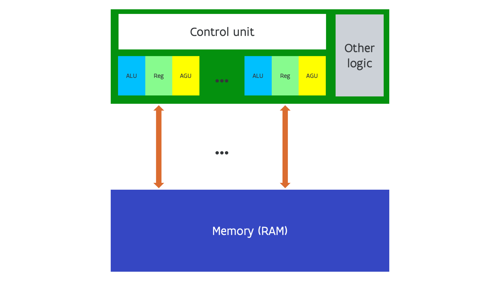

---
tags:
-   vector computing
---

# Data parallelism through vector computing

Modern superscalar execution, with instruction reordering and other 
mechanisms to increase IPC that we have not discussed, requires complicated
logic and hence a lot of power. A common case that is well suited for
superscalar execution as there can be lots of independent instructions,
is working with vectors and matrices. 
This led to the design of CPUs with instructions to work on vectors,
i.e., with wider ALUs and wider registers that do not contain just a single
number but a row of numbers. This has the potential to boost the speed
without the full power requirements of a superscalar processor. 
This is one example of a **single instruction stream, multiple data stream**
(abbreviated as **SIMD**) architecture.

This was a very popular design in supercomputers in the 70s and 80s, but 
then almost disappeared with only two or three vendors still making them
(and only one still making them today).
Examples are the CDC STAR-100 from 1974 and the Cray-1 from 1976. 
The latter was the first vector computer to use a design with registers.
The STAR-100 streamed the data directly from and to memory.
Currently NEC still makes vector computers though with a slightly different
design as before for even faster speeds. Vector registers in the current
NEX SX Aurora TSUBASA architecture are 256 double precision numbers wide,
and the execution unit itself is 32 double precision numbers wide, executing
a 256-number vector instruction in 8 steps.

Vector instructions are also returning in general purpose computers, but then with
much shorter vector lengths.

In the Intel architecture, MMX integer vector instructions with 64-bit wide registers
were introduced in 1996 and available in 1997 on an evolution of the Pentium processor. They basically re-used
the floating point registers in those processors for storing integer vectors so codes
could not combine floating point instructions and integer vector instructions.
Just a few years later, in 1999, Intel launched the SSE instruction set which used
separate 128-bit registers. Originally they were only meant for single precision
floating point numbers (so 4 elements in a vector), and they became available in 
the Pentium III processor which was actually an evolution of the Pentium Pro and not of 
the original Pentium. The instruction set was extended several times with SSE adding
double precision floating point numbers and some integer instructions in the Pentium 4, 
and with further extensions in the SSE3 and SSE4.x instruction sets. MMX instructions are
not present anymore in modern Intel processors in 64-bit mode, but the SSE instructions
are still present. 
A further extension came with the AVX instruction set in the Sandy Bridge generation in
2011. The vector registers were extended to 256 bits and could now handle 4 double precision
or 8 single precision numbers simultaneously. These processors were also used in the first
Tier-1 cluster of the Vlaams Supercomputer Centrum, installed in 2012, and in the
hopper cluster of the University of Antwerp. AVX2 extended the AVX instruction set 
in the Haswell generation and came at the same time as the FMA3 instructions,
the so-called fused multiply-add instructions that combine a multiplication and an
addition in the form a*b+c, effectively doubling the number of floating point operations
per clock cycle. 
A further evolution came in the AVX-512 instruction set using 512-bit wide vectors but also
adding other features that make the vector instruction set a lot more useable (and a lot more
like those on the traditional vector computers). They were first introduced in the now
defunct Xeon Phi processor, a processor specifically designed for supercomputers, but
got a new life in the server variant of the Skylake architecture (Skylake X) and the more
recent Ice Lake and Sapphire Rapids processors. In fact, Intel keeps adding new instructions
for new data formats, especially for AI where some deep learning applications can benefit
from lower precision data formats.

The ARM instruction set has known the NEON vector instructions for quite a while already.
These instructions use 128 bit registers, so can work on 2 double precision or 4 single precision
floating point numbers. Even the processors in most mobile phones support these instructions.
But the ARM architecture is also evolving. ARM designed the SVE instruction set
(Scalable Vector Extension) together with Fujitsu for use in supercomputers. SVE instructions
allow for different implementations with vector registers up to 2048 bit wide, which can store
32 single precision or 64 double precision numbers, but also supports implementations with 
registers as small as 128 bits. The implementation of Fujitsu which is used in the A64fx processor 
of the Fugaku supercomputer (which was the fastest machine in the Top500 lists from June 2020 till November 2021)
uses 512-bit registers. These instructions have been extended with SVE2 instructions that are more
oriented towards integer computations and making the instruction set more useful for non-scientific
applications. SVE2 is now part of the new ARMv9 architecture and used in, e.g., the processors
of the Samsung S22 and S23 mobile phones, but also in the brand new NVIDIA Grace CPU that will
be used in the GPU-accelerated nodes of the first European exascale supercomputer.

AMD also uses vector units int its GCN and CDNA GPUS, with 16-wide single precision 
hardware and 64-wide single precision instructions (well, not completely true for CDNA2), 
and in its RDNA GPUs, with 
32-wide single precision hardware and instructions. The Intel GPUs are also based
on vector computing units with 8-wide units for most basic operations.

## Another type of SIMD computing

There is however another way to reduce the overhead of superscalar execution
that works well for vector operations. 

Rather than widening the ALUs and registers, we can also just use
multiple sets of ALU, register and AGU/load-store units,
but use only a single control unit so that all those
ALU-register-AGU combinations have to execute the same
instruction at the same time, or do nothing, but of course
can operate on different data.

This design is shown in the following figure:

The historical example of this design is the Thinking Machines connection machine 
with the first generation CM-1 machine launched in 1983. However, NVIDIA GPUs are a 
modern example of this design combining 10s or even 100 of those SIMD processor
(which they call SIMT processor) on a chip.

Such processors may seen easy to program as it looks as if you can think in terms
of scalar operations rather than vector operations, but in reality it is not easier
to program them efficiently that it is to program vector machines. And NVIDIA may claim
otherwise, but there is little difference in what the processors can do between this
form of SIMD computing and a vector computer with an instruction set that also 
supports so-called masking or prediction and scatter-gather operations.
Which is in fact also the difference between the AVX-512 and AVX2 instruction 
sets.

## Conclusion on intra-processor parallelism

There are two levels of parallelism in modern processors:

1.  Trying to execute more instructions per clock cycle: *instruction-level parallelism*, abbreviated ILP.

    This is mostly hard work for the CPU control logic and for the compiler, and
    only a limited amount of work for the application developer.
    Moreover, you can expect a gain from this technology even without recompiling
    your application for a newer CPU if that CPU supports the same instruction set.

2.  Doing more work per instruction: data-level parallelism through vectorisation or other SIMD technologies

    This is a much harder job for the compiler as most programming languages do not 
    offer enough information to the compiler. The application developer often needs
    to help the compiler.

    Moreover, you will not gain from the addition of vector instructions to a processor
    design without recompiling for those vector instructions.

    In some applications a lot of the gain over the various generations of CPUs since the late
    '90s has come from better and wider vector instruction sets. But these improvements can
    only be delivered if an application gets recompiled for those new instructions (and then
    it won't run anymore on the older processors). This is one of the reasons reason why on supercomputers
    applications are often installed from source code rather than from binaries.

