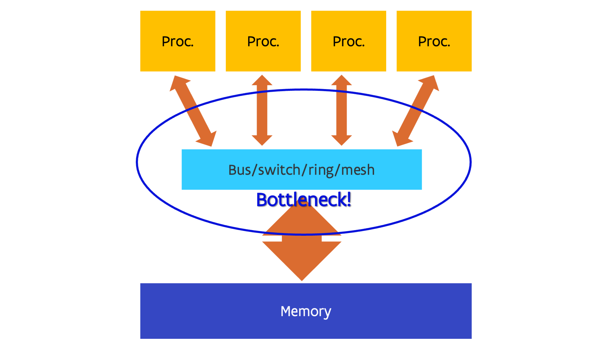
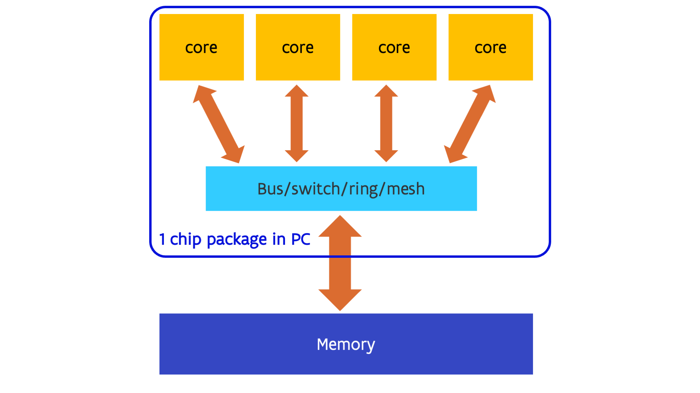
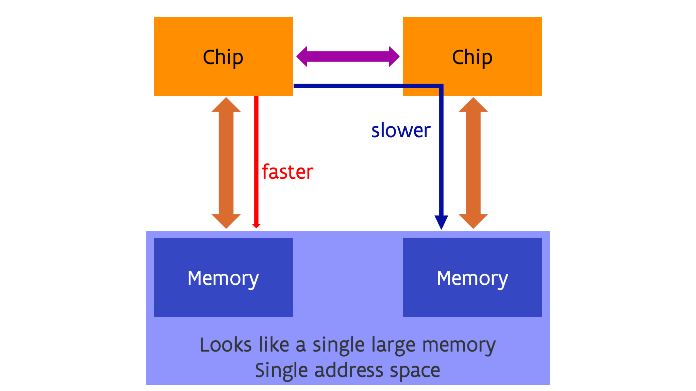
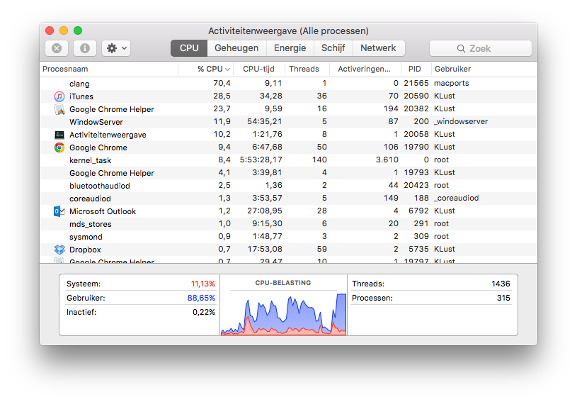

---
tags:
-   core
-   shared memory
-   SMP
-   NUMA
---

# Shared-memory multiprocessing

When making faster processors doesn't deliver enough gains to satisfy the
always growing need for more speed, the next step one can look at is to 
simply use multiple independent processors. This is called Multiple Instruction,
Multiple Data parallelism or MIMD. As every processor is completely independent
of every other one at the execution level, they can all follow their own code
path and work with their own data.

In the first designs, all processors were completely equal which is called
symmetric multiprocessing or SMP. This implies that every process or every thread
can run equally well on all processors. Also, in the more simple designs all
processors also have equal access to all memory. This is called shared memory
with uniform memory access. 

<figure markdown>
  
  <caption>Symmetric multiprocessing and uniform memory access</caption>
</figure>

In the most simple designs, all processors are simply connected to a single bus
that makes the connection to memory. This was, e.g., the case in the first
Intel chips that used this design, e.g., the Core2 Duo which had two processors
on a single die (a single piece of silicon) and the Core 2 Quad that had two such
dies in a single package. In more sophisticated designs a switch is used,
or as switches also have size limits, a mesh or ring network to connect all
parts together. E.g., the early generations of multiprocessor Opteron chips
used a switch architecture, and current generation Intel CPUs use a ring or
in some cases (e.g., Sapphire Rapids server chips) a mesh network.

Early examples of shared memory supercomputers go back to the early '80s. 
E.g., machines such as the CrayX-MP from 1982 were shared memory computers with
uniform memory access.

<!-- TODO: Add some examples from the nineties. DEC Alpha was a switch? SUN Microsystems? -->

Nowadays multiple processors are often integrated on a single piece of silicon
or die, together with the network or switch that links them together. This
has led to a change of terminology as it became unclear what the processor was.
Especially in the PC world, people were used to call the chip, or better, the package containing
the chip, the processor and kept using that term once each package effectively
contained multiple processors. So nowadays the term *core* is used for what used
to be the processor, the smallest unit on the chip that by itself can execute a program.
The name package is often used for the actual part that you buy, which contains one or
more dies with one or more cores each, and is soldered to the motherboard or inserted 
in what is called the *socket*. The term processor nowadays typically refers to the package.

<figure markdown>
  
  <caption>Uniting multiple cores in a package</caption>
</figure>

!!! Remark
    In the world of NVIDIA GPUs, the word "core" has yet another meaning.
    What NVIDIA calls a CUDA core is actually not a core but an ALU
    (and one could even argue, just a small part of a wider ALU).

This uniform memory access design does have a flaw though: 
The more processors you try to link this
way, the harder and less economical it becomes to have uniform memory access.
For a long time, the limit seemed to be at around 8 to 16 cores, 
though the very high core number packages on the market today do
succeed in offering a near uniform memory access to all cores.
The connection to the memory does tend to become
a bottleneck in such designs (and there are other bottlenecks also that
are far too complicated to discuss in this short course).

This has led to another design, which has in the Intel world always been used
when multiple packages were used in a single shared memory machines since
the days of the Nehalem processor which launched in late 2008:

<figure markdown>
  
  <caption>Non-Uniform Memory Access</caption>
</figure>

Each package, which could itself be a multi-core processor, has part of the system
memory attached to it. The processor packages are connected through a special-purpose
network that connects the packages in such a way that each core has access to all memory
in the same way. These networks go under the name UltraPath or UPI in recent Intel 
designs, or Infinity Fabric or xGMI in the case of AMD (AMD uses more and more xGMI as the
name for external connections while Infinity Fabric is used for the technology when used
inside a package to connect the dies, but they are basically two variants of the same 
transport). A new connection type coming up is CXL (which stands for Compute Express LinkTM)
which will also have its variant to connect
dies in a package called Universal Chiplet Interconnect ExpressTM, abbreviated UCIe.
CXL is itself an extension of the PCIe interface which is already used for expansion boards
but adds more features to create a global memory pool with (and this is something that will only
be explained in a later chapter) so-called cache coherency (which is still lacking in the first
versions of the standard).

In this design each core can still directly reach all memory in the computer, but the speed
of access can be very different for different parts of the memory. In the case of the figure
above, each core in a given package has fast access to memory directly attached to the package 
and slower access to the memory attached to the other package. So even though from a logical
point of view there is just a single large memory space with a single (physical) address space,
but from a performance part of view not all memory is equal. This is called a 
Non-Uniform Memory Access or NUMA design. NUMA is transparent with respect to correctness of programs
but it is not fully transparent (or sometimes not transparent at all) when it comes to performance,
and it is something that has to be taken into account when running software on such 
a design.

All current multiple-socket server CPUs use a NUMA architecture, e.g., the Intel Xeon, AMD EPYC and
IBM POWER processors. 
Probably the largest NUMA design in terms of the number of sockets was the SGI Altix UV system
which could scale to 64 sockets. After the merger with HPE it was renamed to HPE Superdome Flex.
(The current version as of 2025 scales to only 32 sockets.)
Currently one may even have NUMA within a chip. This was very pronounced with the 
first generation AMD EPYC server processor code-named Naples, which had 4 chiplets each with
up to 8 cores and their own memory, and those chiplets were linked together via an internal
Infinity Fabric network (and the same network was also used to link two sockets). It is still
somewhat present in newer AMD CPUs also, though mostly in a different way that we will return to later
in this course. It is also showing up in the higher core count Intel Sapphire Rapids
CPUs launched in early '2023, where a single socket should be treated as 4 NUMA regions each
with a quarter of the memory connected to the socket.

## A look at the software side

On the software side, shared memory processors are exploited through the mechanism of processes with
threads.

A process is an operating system concept. It is basically a program being executed. 
It is created when you start an app on your phone, click on
a `.exe` file in Windows or most of the times when you type a command in Linux. 
In modern operating systems, each process has an amount of (virtual) memory that processes 
cannot access and can have exclusive access to files etc. So it is the entity that owns
a part of the shared resources.

In the old days, like in the days of MS-DOS, the operating system of most PCs in the '80s, 
there was only a single stream of instructions executed in the context of a process (and
MS-DOS didn't even have a true notion of multiple processes). The early versions of UNIX
had decent support for multiple processes but could support only one instruction stream
per process.

The problem is that in such designs a single application cannot easily exploit multiple 
processors. This was solved by threads. A thread is an instruction stream that is being
executed in a process with an execution path that is independent on that of other threads. 
Threads of the same process share all resources. Every thread can
see all memory of the process. Even though there is some thread-private memory this
is not protected from access by other threads. Things like file descriptors (the structure 
that is created when you open a file) are also shared in a process.

Threads can run on different cores, though one core can also execute multiple threads (just
as one core in older operating systems could execute multiple processes) by the mechanism of
time sharing: The processor continuously switches between the execution of different threads.
In modern operating systems users may have thousands of threads running simultaneously,
though typically most of these threads are not very active.

Consider, e.g, this thread and process view from the Mac laptop the author of these notes
used to use:

The laptop on which this screenshot was made had only two physical cores, yet was running
315 processes with a total of 1436 threads. Some processes use only a single thread,
like the `clang` process at the top, which is a C compiler.
But, e.g., Google Chrome was playing a video at that time and had 50 threads, not counting 
the 16 of a helper process.
Most threads are really background threads that are waiting for input, e.g., keyboard input, 
data arriving from the network, etc.

When running scientific software one often needs to take control of the computational threads.
These threads can use almost the full capacity of a core and for reasons that will become 
clearer later in this course it is important to keep them on separate cores and not use
more of those threads than there are cores. 

!!! Remark
    NVIDIA also abuses the word "thread" as the so-called threads on an NVIDIA GPU are not
    independent of each other but need to execute in synchrony in groups of 32 called a warp.
    The warp is a much closer equivalent to a thread on the CPU.

## Hardware threads

Threads in the context of operating systems should not be confused with so-called hardware
threads.

A problem with large superscalar processing cores is that often a single instruction stream
does not contain enough parallelism to exploit all compute resources in such a core. This is
certainly the case for code with lots of tests with unpredictable results. 
For those applications it may be beneficial to try to run multiple instruction streams simultaneously
on a single physical core. So some CPUs can split up a physical core in multiple virtual
cores. Each virtual core has its own architectural register set, but the threads running on those virtual
cores effectively compete for all resources of the core. To the operating system, the virtual cores
are seen as the actual cores on which threads are scheduled. So if, e.g., you have a computer with
1 socket and 8 cores that can each support 2 virtual cores, the operating system will report the
computer as having 16 cores (though it may understand that these are actually 8 pairs of two).

This technology is known under different names. The generic name is **Simultaneous Multi-Threading** 
or **SMT** which is also the term used by IBM for its POWER CPUs and by AMD for its Zen architecture CPUs 
(Ryzen and EPYC). Intel uses the term **hyper-threading** instead and Oracle uses the term **hardware threading**.

The gain one can get from enabling SMT depends a lot on the architecture of the CPU and on the application.
E.g., on the regular Intel Xeon or Core i7/i9 CPUs the gain is often rather limited. However, on the Xeon Phi
(a chip that Intel made for HPC and is a descendant of the original Pentium architecture) in the KNC (Knights Corner)
generation you needed to use at least two hardware threads on each core to extract the full performance
of the core at it was not capable to fetch and decode instructions from one hardware thread in subsequent 
clock cycles. Intel architecture cores in modern PCs that support SMT all support only two virtual cores per
physical core. The Xeon Phi however supported four, and some recent IBM POWER processors support 8-way SMT.

SMT is fully transparent for software when it comes to correctness of programs, but it is not transparent
when it comes to performance. As the benefit for scientific applications is not always that large, 
it is not always enabled on supercomputers. But even when it is enabled, with a careful selection of options
when you start a process in a job you may still limit your use to a single virtual core per physical core,
even though that would still have a (very) small performance penalty compared to a system where SMT is explicitly 
disabled.

## Programming shared memory

Automatic parallelisation is less successful than automatic vectorisation. So in most cases you'll
have to do the work as a programmer. There are several approaches that we will discuss later 
in [the chapter on middleware](../C06_Middleware/index.md).

Of course one can exploit shared memory parallelism easily in cases where you have to do a large number
of independent runs that don't need that much memory so that you can simply start a run on each core.
But in other cases it will require a bit more work to exploit the shared memory level of parallelism,
and even a redesign of algorithms as the best sequential one may not be the best in a parallel implementation.

And even as a user you need to be aware of shared memory parallelism as you will often need to tell the 
program how many threads it should use, or may need to help it a bit to link threads to specific cores in
the proper way.

