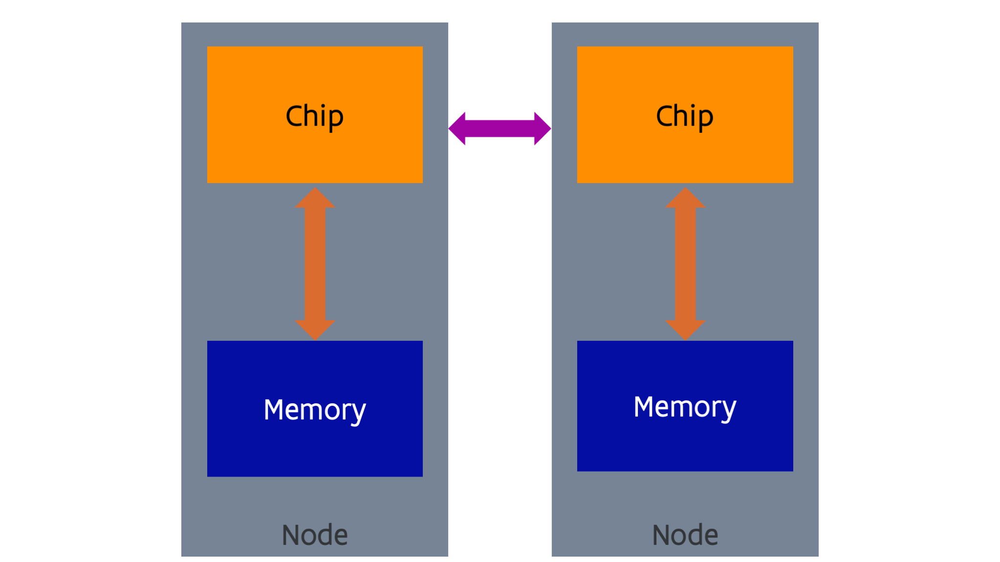

---
tags:
-   distributed memory
-   MPI
-   Beowulf
---

# Distributed memory computing

NUMA shared memory machines also have their scaling limits .
From a hardware point of view is is difficult to impossible to build a network that is 
fast enough to link together a large number of sockets in a way that memory access
is fast enough, and there is another issue that we have not yet discussed that poses
an even bigger limit (for those who know something about processor technology: ensuring
that the caches of all sockets are coherent, so that every core reads the same value at
the same memory address at any given time).
There is also a scaling limit in software. Existing operating systems also do not scale
well enough to large shared memory systems. It may need more than just changes to 
the OS scheduler (the part of the OS that decides at every moment which thread will
run on which core) to cure the scalability issues.
And lastly there is also an economical reason. Building large networks with low latency
to offer transparent memory access is also very expensive.

The solution scientists and vendors came up with was to take a number what may look like
a pretty standard computer (called the *nodes* of the supercomputer) and link
them together with a fast network (called the **interconnect**). 
The concept is shown in the following figure:

The picture looks almost exactly as the one for NUMA shared memory, but there is one
big difference: the nature of the network. The network cannot support direct memory
access (and coherency of caches, something that we have not seen yet) as in the
NUMA shared memory case, and has a higher latency and lower bandwidth, but can
economically cover longer distances. The network is used for communication via
sending and receiving software-initiated messages. There is no joint global
address space (at least not in hardware, some companies have tried to emulate
that in software). 
There is an evolution towards interconnects with some limited
memory semantics that make it easier to create some kind of global address space,
but not to the extent that it is as transparent to use as in the case of a 
NUMA shared memory machine.

??? Note "Virtual shared memory solutions"
    Many research projects and startups have tried to emulate shared memory over
    distributed memory cluster interconnects. Some software presented a virtual
    machine to the OS, while other software solutions work more at the user level
    and just try to present a shared memory to an application.

    ScaleMP was a company that made a virtual shared memory machine
    running over InfiniBand clusters. That software was also offered on the first
    Tier-1 system of the Vlaams Supercomputer Centrum for those users who needed
    more memory and a larger number of cores in shared memory than nodes at that
    time could offer. In 2021 ScaleMP was bought by SAP, and its products are no
    longer available.

    These technologies are not very important anymore today as the scalability
    limits of shared memory, especially at the software level, can be reached
    already on a single node.

As there is no direct access to the memory of another node, it is also not possible
to run a process across nodes. So an application will consist of multiple processes,
at least one per node, that communicate with each other by sending messages over
the network. Such supercomputers are even harder to program than shared memory
computers, but are also far more scalable. The largest supercomputers in the world
that only use regular processors as we discuss in this chapter (and no accelerators,
something that we will discuss towards the end of the course) have more than 
5 million cores.

Distributed memory computers found their origin in the '80s in research aiming at
building cheaper supercomputers using more standard components, as it became quickly
clear that CMOS semiconductor technology would soon become the technology of choice to 
build powerful microprocessors that could evolve much faster than the large purpose-built
supercomputer processors (that also needed to shrink in size as the size became the
limiting factor for the clock speed). The Cosmic Cube, built at Caltech in 1981
using standard Intel processors similar to the ones used in the first IBM personal
computer, was probably the first example. Intel built and commercialised an evolved
version of that design with their series of iPSC supercomputers. However, by 
the '90s, the more traditional supercomputer builders also adopted this design,
with, e.g., the IBM SP/1 and SP/2 that
used POWER processors that were also used in IBM workstations and UNIX servers, Convex
Exemplar that used HP PA-RISC processors (which they also used in their workstations and 
UNIX servers) and the Cray T3D based on DEC Alpha processors (again a processor for
workstations and UNIX servers).

??? Note "Early distributed memory supercomputers in Belgium"
    The department of computer science of the KU Leuven has operated two smaller
    computers from the iPSC series, basically to be able to develop code to then run
    on bigger supercomputers of that type elsewhere.

    In 1994, the central compute facilities of the KU Leuven acquired an IBM SP/2 system.

Another evolution got triggered in the early '90s. In 1994 Linux 1.0 was launched
which worked well on standard PC hardware of those days. Researchers came up with the
idea of combining very standard off-the-shelf PC's or small servers often running Linux with very
standard off-the-shelf network technology (Ethernet, in 1994 this was still 
only 10 Mbits per second using the 10BASE-T standard,
with 100 Mbit/s technology only being standardised in 1995). These clusters were called
"Beowulf" clusters. The name refers to one of the first such clusters build in 1994 at NASA.
However, a 100% Beowulf design had many shortcomings. The Ethernet technology of those days
was way too slow to build a system that would be able to run a lot of software in a scalable
way on a large cluster. 
Reliability was also a problem. PC's and workstations still crashed
rather often. Now one crash every 50 days may not seem a real problem for a workstation or PC, 
but if you build a supercomputer with 1000 such computers you can expect 20 node crashes per day
making it impossible to run an application at the full scale of the machine. To build a proper
supercomputer you need very fast network technology, so supercomputer companies kept designing 
specific network architectures for that purpose, and reliable components.

This is shown nicely in the following anecdotes, taken from the 
[IEEE sepctrum article "How to kill a supercomputer: Dirty power, cosmic rays, and bad solder"](http://spectrum.ieee.org/computing/hardware/how-to-kill-a-supercomputer-dirty-power-cosmic-rays-and-bad-solder) (you may need to be at an institution with 
library access to this journal to read the article).

-   ASCI Q was a supercomputer built in 2002 at Los Alamos National Laboratory. 
    It consisted of 2048 4-socket nodes with the DEC Alpha EV-68 (21264C) processor,
    probably the fastest single chip processor at that time for scientific computing.
    However, the computer had a node crash on average every hour due to sensitivity to
    cosmic rays. With better shielding they managed to improve the reliability to one crash
    per 6 hours on average. This was due to a design flaw in the DEC Alpha CPU, where there
    was a data path that was not protected with error correction.

-   Big Mac was a real Beowulf design built in 2003 at Virginia Tech using 1,100 PowerMac G5 servers.
    That machine actually started crashing before it was completely booted. It too was too sensitive
    to cosmic rays as it did not use memory with error correction (so-called ECC memory which is
    nowadays used in almost all servers).

-   Jaguar, a Cray XT5 system installed at Oak Ridge National Laboratory in 2009, was a very nice
    real supercomputer design. It was the largest system in the world at that time,
    with 360 TB of memory and 18,774 nodes with 2 AMD quad core processors and custom network
    technology. Monitoring showed that there were 350 errors per minute in the memory that could
    be corrected by the ECC protection. However, on average there was still an uncorrectable
    2-bit error every 24 hours...

## Programming distributed memory

Automatic strategies through the compiler have never made it past the research phase.

A trivial way to exploit distributed memory computers is to run one or more independent programs
on separate nodes. But that is of course not what such a machine is built for as usually you
wouldn't need such an expensive network for that use.

Developing software for distributed memory computers is rather hard work for the programmer.
There are some programming languages that help a little though, but as for share memory
computing we will discuss that in a little more detain in the
[chapter on middleware](../C06_Middleware/index.md).

