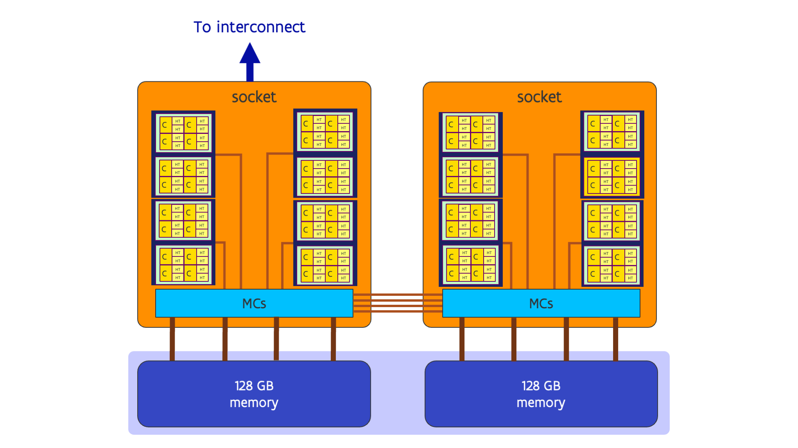

# Some node architectures

## AMD Rome node (as used in Vaughan @ UAntwerp)

A large fraction of the compute nodes of the University of Antwerp cluster
Vaughan consists of second generation AMD EPYC nodes (code-named Rome) 
with 32 cores. 

<figure markdown>
  
  <caption>2 socket node with 32-core AMD Rome CPUs</caption>
</figure>

Each CPU package of the variant of the Rome CPU used in Vaughan contains
5 chiplets. 4 chiplets are identical and contain 2 groups of four cores
each, with each core supporting 2 hardware threads. The group is also called
the Compute Core Complex (CCX), the die the Compute Core Die or CCD.
Each CCD then connects to the fifth die, the I/O die, with an
Inifinity Fabric link that is very similar to the links that are also
used to connect the I/O dies in the two sockets. The I/O die also
contains the memory controllers which in case of Vaughan connect
to 128 GB of memory per socket. The sockets are connected through
4 Infinity Fabric or xGMI links. 

In reality the architecture is a little bit more complex as the following
figure suggests:

<figure markdown>
  
  <caption>2 socket node with 32-core AMD Rome CPUs, NUMA-domains</caption>
</figure>

The I/O chiplet itself is logically subdivided in 4 quarters with each quarter
connecting to one compute die in Vaughan or 2 compute dies in those variants that
have 8 CCDs per package, and each quarter also has its own memory controller 
connecting to 32 GB of memory. Though it is possible to let the four quarters 
function as one, in HPC applications it is often beneficial to let them 
operate as if they are 4 separate memory domains, giving slightly better memory
performance for memory access via the memory controller attached to the quarter
containing the core, and maybe slightly slower to memory in the other quarters.
Many supercomputers with these processors have their nodes configured to work
in that way so that the operating system might report 8 NUMA domains rather than 2.

One of the sockets (and in fact the I/O die in that socket) is then connected
to the interconnect network card.

A variant of this design is also used in the older compute nodes of the VSC cluster
Hortense at the University of Ghent. Those node however use the 64-core variant with
8 CCDs per socket, so 16 CCXs per socket (but still 8 NUMA domains per node).

The European pre-exascale supercomputer LUMI operated by CSC in Finland, and the newer
compute nodes of Hortense use 64-core third generation EPYC processors (code-named Milan)
that have one core group of 8 cores per chiplet, so the CCXs and CCDs are equal,
but otherwise the design is again similar to the design of the Rome nodes.
