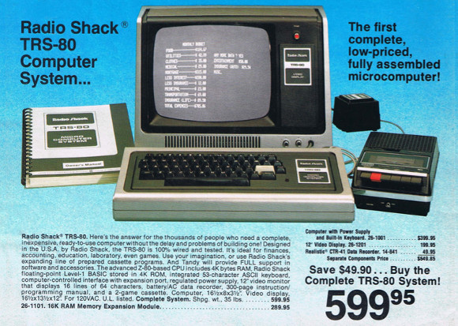

# Fast (past) evolution

Micro-electronics and supercomputers have evolved a lot over the past half century.

Lets compare an iconic supercomputer from 1977, the Cray 1A system of ECMWF, the
European Centre for Medium-term Weather Forecasts, with another iconic device 
launched 30 years later, the first generation iPhone.
The precise specs of the latter are derived
from the little information available as Apple is rather secretive about the processors
it uses, but as this was not yet a custom design information was rather easy to find.

|                   | 1977: Cray 1A (ECMWF)      | 2007: Apple iPhone                           |
|-------------------|----------------------------|----------------------------------------------|
| CPU               | 80 MHz CPU, 160-250 Mflops | 412 MHz, 412 MFlops                          |
| RAM memory        | 8 MB                       | 128 MB                                       |
| Permanent storage | 2.4 GB                     | Up to 8GB                                    |
| Weight            | 5,500 kg                   | 0.135 kg                                     |
| Power required    | 115 kW                     | A few Watts                                  |
| Estimated cost    | $8.86M                     | $500                                         |
| MTBF              | 50 hours                   | Weeks without reboots, years without repairs |
| Extra             | Needed a CDC as front-end  | HAs a built-in monitor                       |

(MTBF = Mean Time Between Failures)

<!--
Data source: iPhone and iPhone 3G: ARM11 CPU, 412MHz, with Vector Floating Point unit (VFP), single and double precision. One manual for a ARM11 core (http://infocenter.arm.com/help/topic/com.arm.doc.ddi0290g/Cegbeedf.html see section 22.11 in the ARM1156T2F-S Technical Reference Manual) mentions that one DP add can be launched every cycle, or one DP multiply or FMA every 2 cycles, so 412 Mflops peak performance with fused multiply-add instructions. (CPU: Found on Anandtech web site).
Weight iPhone 3G: 133gr (Apple web site)
-->

We see that the first iPhone was at least on paper a faster machine than the computer
used 30 years earlier for weather forecasts in Europe, and it was certainly more reliable.

Also launched in 1977 was the VAX-11/780, a mini-computer with 5 5 MHz 32-bit CPU and 
2MB of memory (later models had 8 MB).
Another machine from 1977 was the PDP-11/60 (which was an evolved model of the PDP-11 series, itself
a predecessor of the VAX-11). One of these was acquired by the Department of 
Computer Science of the KU Leuven 2 years later in 1979 and costed back then 3.7 million BEF,
which is just over 90,000 EURO at the conversion rate between EURO and belgian francs of 2000.
That machine had only 256 kB of memory but given the high cost had to be shared by many researchers.

Machines more oriented at home use or other personal use in 1977 were the Tandy TRS-80 model 1 and 
the Apple II. They had processors with a clock speed of 1 to 2 MHz and no floating point hardware
so floating point operations had to be emulated entirely in software, Because of that speeds were
measured in flops per second rather than kiloflops or megaflops per second.
The TRS-80 costed $400 (On the order of 125 EURO in 2021 money) at launch without the monitor 
and had 4 kB of ROM memory that stored the
permanent software and 4 kB of RAM memory (but extensions up to first 16 kb and then 48 kB appeared quickly) 
in its early version. The CPU ran at 1.7 MHz. The only permanent storage consisted
of tape which in fact was just a regular cassette that could also be used for music.

The Apple II, also launched in 1977, had very similar specs, with the MOS Technology 6502 CPU running
at 1 MHz and a similar memory capacity, but was a lot more expensive.

Another comparison to make is one between a thin-and-light laptop from 2014 (a MacBook Air) with
probably the fastest supercomputer in Belgium 20 years earlier, the IBM SP2 system at the KU Leuven.
The SP2 was a distributed memory system with 16 nodes. We added the memory of all nodes together in
the table below.

|                   | 1994: SP2 @ KU Leuven          | 2014: Thin-and-light MacBook Air       |
|-------------------|--------------------------------|----------------------------------------|
| CPU               | 16 66MHz IBM POWER2+ CPUs      | 1 dual-core Intel CPU @ 1.3 GHz base   |
| Speed             | 4.25 Gflops DP                 | 41.6 Gflops DP (more with turbo boost) |
| RAM memory        | 3 GB                           | 8 GB RAM                               |
| Permanent storage | 80 GB                          | 256 GB on SSD                          |
| Weight            | 1,000 kg estimated             | Less than 2 kg with power supply       |
| Power required    | >10 kW estimated               | 45 W                                   |
| Estimated cost    | Roughly 1 M EURO in 1994 money | 1300 EURO                              |

The laptop in 2014 was definitely a lot more powerful than the supercomputer in 1994. And the latter
again had to be shared with many researchers...

The IBM SP2 of the KU Leuven entered at position 198 in the Top500 list of November 1994, 
a list that ranks supercomputers based on their performance for solving very large dense systems
of linear equations.
One year later it was only at position 409.
20 years later, in 2014, you needed a machine running the benchmark at 364 Tflops to make it to
position 198 in tht list. And one and a half year later you would have dropped from the list with
that performance.

So we do note a fast evolution. But it is not by accident that the comparison was with a computer from 2014.
After that the evolution started to slow down a bit, but more about that later in the 
chapter ["Putting it all together"](../../C05_Summary1)...

