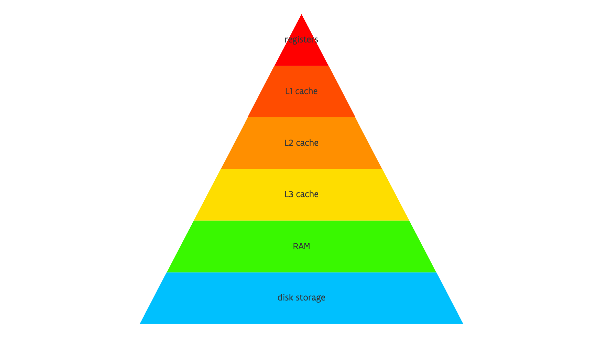

# The memory pyramid

We've seen several types of memory now, and that is structured in a hierarchy.
The typical hierarchy for a regular CPu is depicted above.

-   Each core has registers for integer data, floating point data and/or vectors,
    and some special registers. The architectural register set is rather small but as this
    limits parallel execution inside the processor, modern processors have a lot of
    hidden register space that is used through an automatic mechanism called 
    "register renaming". E.g., the AMD Rome or Milan processors have less than 1 kB 
    of register space in the instruction set, but the total physical register space
    (used with register renaming) is over 6 kB.

-   Processors typically have separate L1 caches for instructions and for data
    (where the data one is sometimes bypassed when using vector instructions).

-   The L2 cache in processors for scientific computing is typically on a per core
    basis.

-   The L3 cache is shared by a number of cores, sometimes even by all cores in 
    a socket

-   The next level in the hierarchy is the main RAM memory, which due to the NUMA
    architecture may appear as multiple levels with different latency and bandwidth

-   The last level is one that will actually be de-activated on many supercomputers
    as it is too slow: When RAM memory is exhausted, the OS can swap some of the
    content to disk storage. But even without swapping enabled we can still see
    the disk as an additional storage space, but then one that we need to 
    manage ourselves in software.

Even this picture is still oversimplified. Processors have other types of small caches,
but those are harder to exploit by our programming style so we should not really take
them into account here. RAM memory may also exist out of multiple layers instead of the
one depicted in the picture.

-   The Intel Xeon Max 9xxx series has 64 GB of high-bandwidth RAM on each socket and then
    up to 1 TB or more of lower bandwidth memory connected externally to the socket.

-   Recently for large memory computers, and especially for database systems, a new type
    of RAM package was proposed that is connected to an expansion card on the CXL-bus,
    an evolution of the PCIe bus (and IBM has its own alternative in its CPUs). 
    Obviously this memory sits even further away from the CPU so we can expect a higher
    latency and less bandwidth. Given that scientific computing applications are often
    already memory latency and/or memory bandwidth limited, this memory type may never
    become very useful in supercomputers.

Let us compare the memory hierarchy for the "Leibniz" cluster and AMD Rome section of
Vaughan of the UAntwerpen infrastructure for 2023, and then with Hawk, one of the largest
CPU-only systems in Europe, at HLRS in Germany, and also based on the AMD Rome CPU

|                         | Leibniz "Broadwell"   | Vaughan "Rome"        | Hawk "Rome"           |
|:------------------------|:----------------------|:----------------------|:----------------------|
| architectural registers | <1 kiB/HW thread      | <1 kiB/HW thread      | <1 kiB/HW thread      |
| physical registers      | ~7 kiB                | ~6 kiB                | ~6 kiB                |
| L1 cache                | 2 x 32 kiB/core (I+D) | 2 x 32 kiB/core (I+D) | 2 x 32 kiB/core (I+D) |
| L2 cache                | 256 kiB/core          | 512 kiB/core          | 512 kiB/core          |
| L3 cache                | 35 MiB/socket         | 128 MiB/socket        | 256 MiB/socket        |
| L3 organization         | 35 MiB/socket         | 16 MiB / 4 cores      | 16 MiB / 4 cores      |
| RAM                     | 128 or 256 GiB/node   | 256 GiB/node          | 256 GiB/node          |
| disk swap               | disabled              | disabled              | disabled              |
| disk storage            | 600 TB                | 600 TB                | 26 PB                 |
| size cluster            | 152 nodes             | 152 nodes             | 5632 nodes            |

So we see that there is in fact very little difference in the hierarchy for a university level 
supercomputer as Leibniz and Vaughan and a very large national or international supercomputer.
However, the total size is very different.

