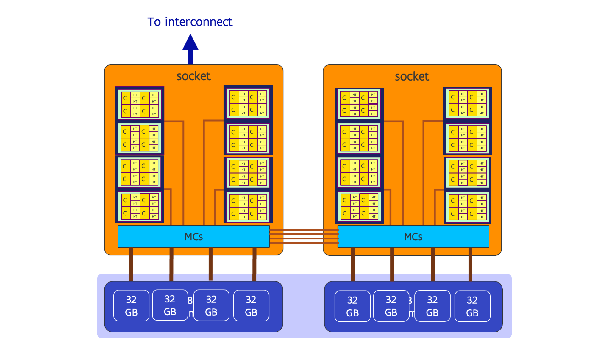

# AMD Rome revisited

The older nodes of the UAntwerpen cluster Vaughan, the VSC Tier-1 system Hortense 
and the login nodes and data analytics nodes of the European pre-exascale supercomputer LUMI
are equipped with AMD Rome processors. These CPUs have a very complex hierarchy:

The picture below depicts the one of the older nodes of the UAntwerpen cluster
Vaughan with 2 32-core AMD Rome generation CPUs:

Each socket in the 32-core version has 4 chiplets with 8 cores each (those chiplets
are also called the CCDs) and one I/O chiplet. Each CCD has two groups of 4 cores
the L3 cache is shared within a group but not between groups. These groups of 4 cores
are also called a CCX or core complex. The two CCXs on a CCD share the connection
to the I/O die with the memory controllers. Each I/O die has 4 memory controllers,
and each CCD has its preferred memory controller through which memory access is 
slightly faster. I.e., we have a mild NUMA architecture on the socket.

The picture for the 64-core variant used in many large supercomputers is not that 
different. In that variant there are 8 CCDs with 2 CCXs each, and each CCD has its 
own connection to the I/O die, but there are still only 4 memory controllers, now with
2 preferred CCDs or 4 preferred CCXs each.

All this leads to the following hierarchy with up to 6 levels:

1.  Each core supports two hardware threads. These two threads share the L1 and L2 caches.
    They are very close together and can communicate through those caches resulting in 
    a short transfer delay and high data transfer bandwidth.

2.  There are 4 cores per CCX, and these cores share the L3 cache.
    This puts them a little further apart, where communication now has to go all
    the way up to the L3 cache.

3.  There are 2 CCXs per CCD. These two CCXs share a link to the I/O die.

4.  When using NUMA-in-a-socket (typical for HPC systems), there is only one
    CCD per NUMA domain in the 32-core variant (so not really an extra level)
    but 2 CCDs per NUMA domain in the 64-core variant. They share a memory
    controller with 2 64-bit lanes to memory. They also share some PCIe lanes
    but that is less important in this context.

5.  4 NUMA nodes share a socket. These NUMA nodes also share a connection
    to the second socket (though technically speaking the situation is a bit
    more complex and too complex for this course).

6.  At the last level, a node has two sockets. On Vaughan and Hortense the two
    sockets share the inter-node interconnect.

The further one moves down along this list, the higher the distance between
executing threads, so the lower the bandwidth at which they can communicate 
and the higher the latency.

To get good performance on AMD Rome processors, it is important to map the application
properly onto this hierarchy. If not, very erratic performance is possible and we have seen
huge performance differences between runs. The problem is that what is a good mapping, depends
on the application and we have no way to give a recipe that works for every application. 
You need to understand the behaviour of your application to do a proper mapping and it depends
a lot on how your code accesses memory.
