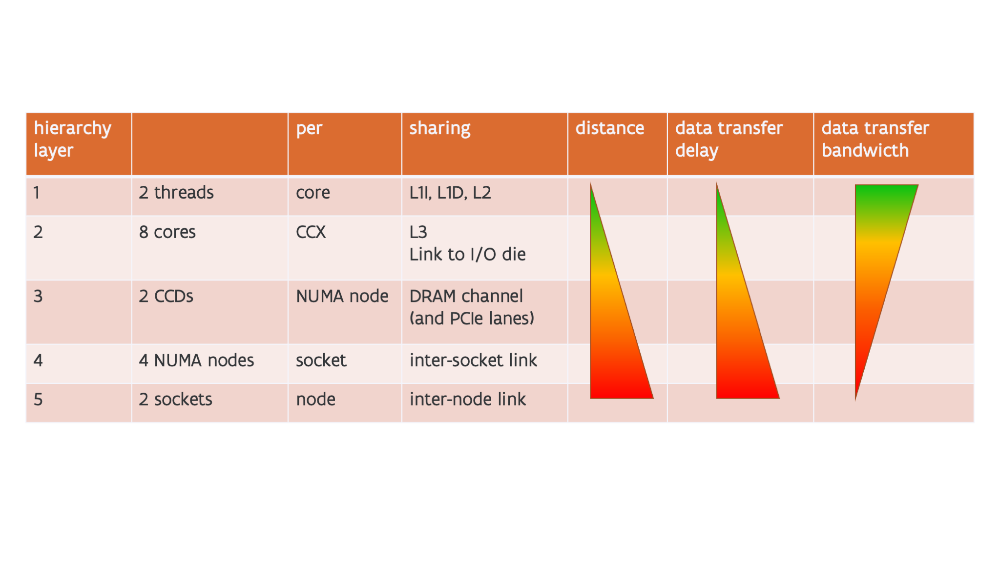

# AMD Milan revisited

The AMD Milan generation that succeeded the Rome generation offers a slight simplification
of the picture. Now the size of the CCX is 8 cores so CCX and CCD are the same. Otherwise
the picture looks fairly identical, but with levels 2 and 3 merged.
Cores within a CCD now share both the L3 cache and link to the I/O die.

But here again a proper mapping of an application onto resources can turn out to be essential
for good performance.

Doing that mapping on a node that is shared with multiple users is impossible as the Slurm
scheduler used on many clusters does not fully support the hierarchy and does not offer enough
control over partial allocations on a node. After all, supercomputers and their system software
are made in the first place for big applications that can fill one or more nodes...

The Milan CPU is used in some of the newer nodes of the UAntwerpen cluster Vaughan, most
phase 2 nodes of the VSC Tier-1 system hortense, and the regular compute nodes and GPU nodes
of the EuroHPC pre-exascale system LUMI.