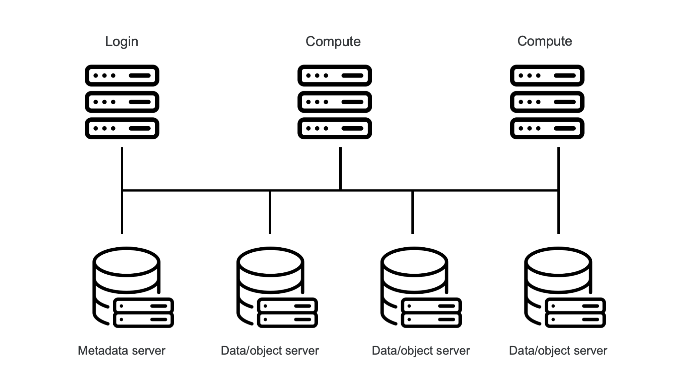

# Parallel file systems

On PCs and many more regular file server file systems, each block on disk can 
be used for either metadata or data. (Well, in practice there will be a zone
that is used exclusively for metadata but that zone is extended transparently
when needed.) These file systems are very flexible and support small file
sizes very well. But at the same time it is very difficult to ge very high
bandwidth, as a file will be managed by a single storage server, so even with
the fastest and most expensive storage attached to the storage servers, the 
single server would ultimately be a performance bottleneck.

Larger supercomputers need a different kind of file system for higher performance,
one where multiple servers can be used concurrently to access a single file.
This is called a parallel file system. 

??? "Popular examples and their use at the VSC"
    -   [Lustre](https://www.lustre.org/) is probably the most used parallel file system on large supercomputers.
        It is used at KU Leuven, the VSC Tier-1 system Hortense at UGent and on the 
        [LUMI](https://lumi-supercomputer.eu/) system in Finland, a pre-exascale
        supercomputer project to which Belgium and Flanders participate.

        Lustre uses two layers. It is implemented on top of another file system that
        is used for the actual disk accesses.

        Lustre is open-source but with companies offering support and doing most of the
        development.

    -   [BeeGFS](https://www.beegfs.io/) has a very similar architecture as Lustre
        and is used for the scratch file system on the clusters of the University
        of Antwerp.

        BeeGFS is open-source, but most of the development is done by 
        a spin-off of a German research laboratory, and they also offer (paid) support.

    -   In the early days of the VSC, [IBM Spectrum Scale](https://www.ibm.com/products/spectrum-scale),
        then known as [GPFS](https://www.ibm.com/docs/en/gpfs/4.1.0.4?topic=guide-introducing-general-parallel-file-system),
        was used on all clusters. However, increasing licensing costs made this impossible.

        Spectrum Scale/GPFS doesn't have the same two-layer architecture as Lustre or BeeGFS (or at least,
        it is not visible), but does the full management of the disks itself.

    -   [Panasas PanFS](https://www.panasas.com/) is a storage system that has its roots in the
        same research project as Lustre. It is a commercial offering consisting of software and
        dedicated hardware. It is currently not in use at the VSC.

    -   [WEKA](https://www.weka.io/) is also a fully commercial offering, but one running on more
        standard file server hardware. It requires a full SSD system though which makes it a rather
        expensive offering. They claim to offer better small file performance than their competitors
        and claim to have solved many of the metadata problems that we will mention below.
        It is currently not in use at the VSC.

In a parallel file system, the metadata is separated from the actual data. The picture below shows
the (simplified) setup for Lustre or BeeGFS:

<figure markdown>
  
</figure>

A Lustre or BeeGFS system consists of three components, all connected via a high performance network
(often the interconnect that is also used for MPI, etc.):

-   File system clients run on all compute and login nodes of the cluster. Applications talk to the 
    client software which then talks to the servers.

-   The metadata servers (MDS)
    take care of all metadata operations, which include controlling the process of opening and closing
    files. 
    
-   The Object Storage Servers (OSS) store the actual data of files. That data can be spread over multiple
    object storage servers.

    Note that this should not be confused with object storage such as Amazon S3 or Ceph.

To open a file for reading or writing, the file system clients talk to the metadata server.
The metadata server will then return information about the location and layout of the file (which
object storage servers contain which parts of the file). 
However, after that the content of the file can be served by all involved object storage servers
and the metadata server is no longer involved in the process of reading the file.
Hence multiple clients in a parallel job can talk to multiple object storage servers simultaneously
and large files can be read with very high bandwidth if the file is indeed accessed in large read
(or write) operations so that this parallelism can be exploited.

Opening and closing files are expensive operations since they do not only involve the metadata
server, but that metadata server also has to talk to the object storage servers for the file. 
However, subsequent reads and writes have again a normal cost compared to regular file systems,
and much higher bandwidths are possible as files are served from multiple servers. 
Depending on the specifics of the file system, some other operations may also be rather expensive.
E.g., on Lustre, doing an `ls -l` is an expensive operation as the size of the file is not 
stored on the metadata server. The metadata server needs to request all object storage servers
used by the file what the size of the chunk stored on that object storage server is.

??? Remark "Storage Targets and Storage Servers"
    The real picture is even a bit more complicated than above. Each object storage server
    can have multiple drive pools attached, called the Object Storage Targets (OST), and files
    are actually distributed across Object Storage Targets. Similarly, each metadata server
    can have multiple Metadata Targets (MDT).

    More redundancy reasons, each OST can be attached to two OSS so that if one OSS fails,
    the other can take over.

A parallel file system can produce very high bandwidth for large read and write operations coming from 
optimised parallel software using the right libraries to optimise that data transport, and this
at a very reasonable cost. However, it has trouble dealing with lots of small files, and
metadata access, certainly to files in one directory, can be a bottleneck. Moreover, the
amount of storage space for metadata is determined when the system is purchased or 
configured as it is on separate servers, so there is also a strict limit to the number
of files such a system can store.

It is not uncommon nowadays for supercomputer centres to impose strict limits on what users
can do on the shared file systems. Just as software needs to adapt to the processing model
of a supercomputer, software also needs to adapt to the way large storage systems on supercomputers
work. You cannot simply run hundreds of instances of that naive PC program that accesses thousands
of files in a short time on your supercomputer, but you have to organise your data in a better
way to scale to supercomputer storage.

??? "The storage on the clusters at the University of Antwerp"
    At the CalcUA supercomputer service, we have different storage systems. The Linux home
    directory is kept small deliberately so that it can be served from a few SSD drives in
    a very high reliability setup to prevent data loss. The system is small, hence a broken
    drive should not break the bank, while there are clear advantages to using SSD drives for
    home directories. The home directories are on a regular Linux file system served to the 
    compute nodes via NFS as that better fits the typical data access pattern to the home
    directory than a parallel file system.

    The centrally installed applications are also installed on SSD drives. As program files 
    are relatively small to very small and as packages like Python and R need thousands of 
    very small files, it is served by a regular Linux file system exported to the compute
    nodes via NFS as this setup is better at dealing with small files than a parallel file
    system, certainly on a cluster the size of the one at the University of Antwerp.

    Next there is a 50TB file system on regular hard drives in a RAID setup with two
    redundant drives for every 8 drives. It uses a regular Linux file system served
    through NFS. We made this choice to also have a somewhat larger file system that
    can deal better with small files than a parallel file system can. It is, e.g., a 
    good file system for users who want to build their own Python or R installation.

    The largest file system is a roughly 0.7 PB scratch file system. That uses 120
    regular hard drives spread over 7 object servers for the storage of the data,
    and a number of SSDs for the metadata. The low latency of SSDs is very important
    to get good performance from the metadata servers, and again a broken SSD won't
    break the bank as there are only few. But for the object servers hard disks are 
    used as they are an order of magnitude cheaper than SSDs. 

