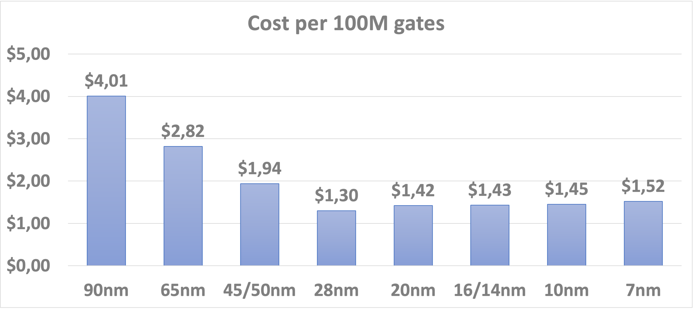

# Cost of transistors

The cost per transistor may not be the ideal number to compare chip process generations
as chips are actually paid per wafer. And the cost per useful transistor on a wafer will
also depend on the die size, how tolerant individual chips on the wafer are to defects,
and the defect rate. It is however an easy number to work with.

The following graph is based on numbers found in a report of the Marvell Technology Inc 2020 Investor Day. 
(Marvell Technology Inc is a fabless semiconductor company.)

For a long time the cost per gate (or transistor) decreased rapidly with each 
new process generation. In fact, the cost per wafer did not increase much while the
gate density doubled with each new process generation. This ended with the 28nm
generation, From the 20nm generation on (which TSMC launched in 2014) the cost
per gate did not longer decrease. Instead, the price per wafer started to grow 
again. This is also the moment that gates on a chip could no longer be made as
flat 2D structures, but 3D structures were needed instead to control leakage,
requiring more and more process steps as the miniaturisation further progressed.

Nowadays processors and computers still become faster with every generation though
not at as fast a rate as before (see the breakdown of Dennard scaling), but the cost
starts to rise again. It is no coincidence that every new generation of high-end
graphics cards or almost every new generation of high-end smartphones is more 
expensive than the previous one. The cost of high end processors for servers and
supercomputers is also exploding the last couple of years. And the price per flop
is hardly going down anymore. The only way this can still improve is by 
architectural innovations that make processors more efficient so that more work
can be done per transistor.

This also implies that we cannot expect a drastic growth in supercomputer performance
in the near future without a matching growth of budgets. 

It also implies that the only way to get more research results on supercomputers
without growth in funding is paying more attention to the quality of the software
that is used and the way the supercomputer is used.

