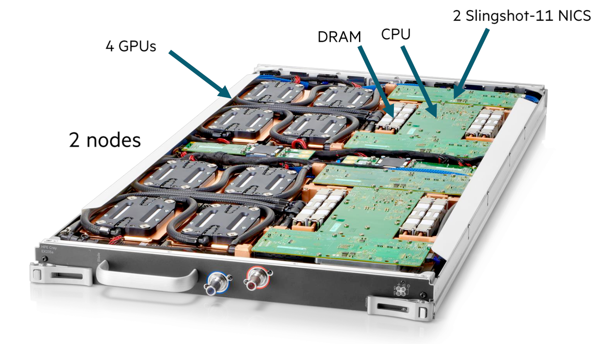
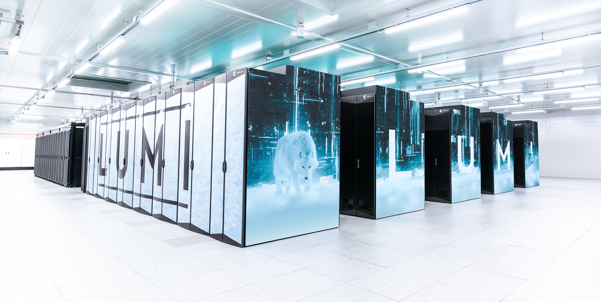

# Building up the supercomputer

## The UAntwerpen Tier-2 clusters

### The admin nodes

The admin nodes that run all cluster management software and the login nodes of
a cluster are nothing special as the next picture shows.

These are standard servers of a format known as "2U", just under 50cm wide and 9cm high.
There is a lot of space for disk drives in the front, but this is not where the storage
for the cluster is build. These disk slots are mostly empty and only used for the disk
space that each of the servers need themselves.

### The storage nodes

The storage nodes of the UAntwerpen cluster are currently also build from fairly
regular hardware components.

The top part of the rack houses two regular servers similar to the ones for the 
admin and login nodes. These servers serve the user file system (home directories),
the applications file system and a 50TB hard disk based file system (called the data file system) that is also
exported to other clusters in the VSC consortium and is also meant for some 
tasks that a parallel file system is not good at. The drives however are not in
those servers, but in the two boxes just underneath. These are a high-quality and
fairly expensive storage system. The larger main box and the smaller box underneath
house the SSDs for the user and application file systems and the hard disks for the
50 TB data file system. It actually also contains the SSDs that are used for the
metadata of the parallel file system.

The lower part contains again two servers. These servers run the parallel file system
in virtual machines. Both the metadata and object servers run on those servers.
The drives for the metadata are in the storage system in the upper half. The hard
drives for the object servers are in the storage enclosures just above and just
below the servers. Each box can contain 4 groups of 15 hard disks.

### The compute nodes

The regular compute nodes of the UAntwerpen clusters are spread over several
racks. The picture below shows 3 racks of compute nodes from the cluster called
"Leibniz" which was installed in 2017 and will be decommissioned in 2024, and
some leftover nodes from the even older compute cluster Hopper.

The nodes of Leibniz are grouped in groups of 24 compute nodes. Each group consists
of 6 enclosures that each have the same width and height as the login and admin nodes,
but now house 4 2-socket servers. These are basically trays that half half the height
and half the width of the enclosure. At the front there is again room for disks, 12 per
enclosure so 3 per node, but these are largely empty. In fact, filling them up completely
would even be bad for the cooling of the node as cold air is sucked in from the front and
leaves again at the rear side.

Above each group of 24 compute nodes there is a switch with 40 ports. 24 of those ports connect
to the compute nodes, while the other 16 go to a series of switches mounted at the top that 
connect the switches with each other and with the storage and admin nodes of the cluster. 
This network architecture is called a tree.

The picture below shows a compute node from an even older cluster, hopper. It is a compute node
from the section in the lower left of the previous picture.

We see 2 CPUs with a passive cooler on them (so just a heatsink), some memory (in this case 
2 modules on each side of each CPU), and a small add-in card with the interconnect at the front.
The photo shows two hard drives at the rear end, though Hopper only had one.

In this case, an enclosure contains 8 nodes and is twice the height of an enclosure of Leibniz.
Powerful fans suck in air from the front and spit it out at the rear. The air flow through a
node is so well controlled that the CPUs themselves don't need fans, contrary to what one 
usually sees in PCs. The problem with PCs is that they are made to be very extensible and 
are also often in cases that are not tuned to the precise parts in there, making it impossible
to control the air flow enough to cool the CPU without giving the CPU its own fan. 
Having the fans in the back is good for reliability though. On a system that large with that many 
fans, you can be sure that some will fail during the life span of the cluster, and having them at
the back makes it very easy to replace them. A bad element of this design though is that the
hard disk is at the hot side of the node. With temperatures as high as in modern compute nodes 
and storage that is very sensitive to temperatures and often cannot handle temperatures above 30 or 35 
degrees well, this would no longer be possible.

## The first VSC Tier-1 cluster

The picture below shows the outside of the first Tier-1 cluster of the VSC consortium, which was
installed in a then branch new data centre at the University of Ghent in 2012. It uses the same
architecture as the Hopper cluster mentioned above and is build out of groups of 24 compute nodes
in 3 enclosures of 8 nodes as shown above.

The picture also shows some coolers. They connect to a cold water circuit in the compute room.
Hot air is sucked in from the rear and blown out in the front, while the compute nodes suck in
cold air at the front and push it out again at the rear.

To make this efficient two rows of racks with opposite orientation are put next to one another,
and the space in between is closed off with a ceiling and doors, forming a hot aisle between the
two rows. This is shown in the picture below:

We can again distinguish the coolers, and the racks in between have perforated doors at the inside.
Depending on the cluster, the temperature inside that hot aisle can be as high as 35 or 40 degrees,
while the temperature in the data centre itself is kept at 20 to 25 degrees with that generation
of hardware.

## A real supercomputer: The HPE Cray EX

Pushing air around consumes a lot of energy, especially if air has to be put at very high speed through
the narrow spaces of high density servers, while the density has to be high to reduce the length of 
cables for the interconnect. Some servers house one or two CPUs and 4 modern GPUs in a box less than 
50cm wide and 9cm high, while producing roughly 3kW of heat. In fact, the energy consumption of just the
fans that move air around can be 10% of the energy consumption of a cluster. Air is also a very inefficient
medium to transport heat. Liquids tend to be much better than that. Hence big modern supercomputer
often cool most if not all components with water. The added advantage of this is in fact that the water
can also be warmer, both when entering the system and when leaving it again, then with the air cooling
solution described above. An example of a fully water cooled system that is also very dense and very
well designed to reduce the amount of fragile cables, is the Cray EX architecture.

The HPE Cray EX architecture is currently (2025) used for some of the
biggest supercomputers in the world, including the 3 first US exascale systems Frontier, Aurora and El Capitan
and the pre-exascale system Perlmutter, the European pre-exascale system LUMI
and the Swiss system Alps.

<figure markdown>
  
  <caption>Structure of the Cray EX supercomputer</caption>
</figure>

Let's now have a look at how everything connects together to the European pre-exascale 
supercomputer LUMI. LUMI has two types of main compute nodes:

-   CPU-only nodes have 2 64-core AMD EPYC processors with 256 GB, 512 GB or 1 TB of RAM,
    and one Slingshot 11 interconnect port. Slingshot 11 is an interconnect designed by
    HPE Cray and very well suited for both small and very large machines. This section
    of the computer is also called LUMI-C.
-   Nodes with 1 64-core AMD CPU and 4 AMD MI250X GPUs. This node type will also be
    discussed later in these lecture notes when discussing accelerators.
    Each GPU has 128 GB of very high bandwidth memory, and the CPU connects to 512 GB
    of RAM, bringing the total to 1 TB of RAM memory per node. Each node also has 
    4 Slingshot 11 ports. This section of the computer is also called LUMI-G.

The Cray EX architecture does use a custom rack design for the compute nodes that is also fully water cooled.
It is designed for maximum density to keep connections in the machine as short as possible.
It is build out of units that can contain up to 4 custom cabinets, and a cooling distribution
unit (CDU). The size of the complex as depicted in the picture is approximately 12 m2.
Each cabinet contains 8 compute chassis in 2 columns of 4 rows. In between the two
columns is all the power circuitry. Each compute chassis can contain 8 compute blades
that are mounted vertically. Each compute blade can contain multiple nodes, depending on
the type of compute blades. HPE Cray have multiple types of compute nodes, also with 
different types of GPUs. In fact, the Aurora supercomputer which uses Intel CPUs and GPUs and
El Capitan, which uses the MI300 series of APU (integrated CPU and GPU) will use the same
design with a different compute blade. 

Each LUMI-C compute blade contains 4 compute nodes
and two network interface cards, with each network interface card implementing two Slingshot
interfaces and connecting to two nodes. The picture below shows a very similar node,
but with 4 network cards each providing 2 network connections rather than 2 such cards.
On LUMI, only the middle ones are present.

<figure markdown>
  
  <caption>Blade with 4 CPU nodes and 8 Slingshot ports</caption>
</figure>

At the front of this blade there are two connections to for the water cooling. The 
network connections are on the back but are not visible in this picture.

A LUMI-G compute blade contains two nodes and
4 network interface cards, where each interface card now connects to two GPUs in the same 
node. All connections for power, management network and high performance interconnect
of the compute node are at the back of the compute blade. At the front of the compute
blades one can find the connections to the cooling manifolds that distribute cooling
water to the blades. One compute blade of LUMI-G can consume up to 5kW, so the power
density of this setup is incredible, with 40 kW for a single compute chassis.

<figure markdown>
  
  <caption>Blade with 2 MI250x GPU nodes and 8 Slingshot ports</caption>
</figure>

The back of each cabinet is equally genius. At the back each cabinet has 8 switch chassis,
each matching the position of a compute chassis. The switch chassis contains the connection to
the power delivery system and a switch for the management network and has 8 positions for 
switch blades. These are mounted horizontally and connect directly to the compute blades.
Each slingshot switch blade has 8x2 ports on the inner side for that purpose, two for each compute
blade. 

The picture below shows a Slingshot switch blade, with the side facing the compute blades
at the front. It has 8 square connectors, one each to each compute blade, but each connector
carries two Slingshot connections. The connectors on both sides are for power and monitoring.

<figure markdown>
  
  <caption>Switch blade, side facing the compute blades, with 8 double ports</caption>
</figure>

The next picture shows the outward facing side of the switch blade. There are 24
electrical connectors, but each again carries two Slingshot links. At the far left
and far right you can again note the connectors to the water cooling. Each switch
itself can consume up to 250W and is also fully water-cooled.

<figure markdown>
  
  <caption>Switch blade, outward facing side</caption>
</figure>

As each switch blade carries two ports per compute blade,
for LUMI-C two switch blades are needed in each switch chassis as each blade has
4 network interfaces, and for LUMI-G 4 switch blades are needed for each compute chassis as
those nodes have 8 network interfaces. Note that this also implies that the nodes on the same 
compute blade of LUMI-C will be on two different switches even though in the node numbering they
are numbered consecutively. For LUMI-G both nodes on a blade will be on a different pair of switches 
and each node is connected to two switches.

The picture below gives an impression of how this works for blades with 4 CPU nodes with 1 (left) or
2 (right) connections to the Slingshot interconnect.

The picture is not completely right as the interface coming from NMC0 should not connect to the HSS
port but to the Switch 3 port. In these pictures, each node has two CPUs and those CPUs are next to each 
other, not on top of each other, so the nodes are arranged in a 2x2 grid. Between each node pair there are
4 PCIe connectors, 2 of which connect to the upper node and 2 of which to the lower node. NMC0 and NMC1 are
the Slingshot network cards, and each has 2 PCIe connections that go to connectors that connect to 
different nodes. In the left picture, with one Slingshot connection per compute node, node 0 and 1 connect
to the switch in slot 3 while node 2 and 3 connect to the switch in node 7. In the right picture, with one
Slingshot connection per CPU or two per node, Node 0 and 1 both connect to two switches, the ones in slot 3 and slot 1,
while node 2 and 3 also both connect to two switches, the ones in slots 5 and 7. This setup gives each CPU
direct access to the interconnect without interfering with the other CPU in the node.

There are still free positions in the switch chassis as there is currently no node type that has more than
8 network ports per blade. These could still be useful in the future though. If not for an interconnect,
one could, e.g., export PCIe ports to the back and attach, e.g., PCIe-based storage via blades as the 
switch blade environment is certainly less hostile to such storage than the very dense and very hot
compute blades.

The storage of LUMI uses hardware that looks more conventional. Disks are also in JBODs just as in
the setup of Vaughan. The file servers themselves though may look conventional on the outside
but are also a special design at the inside, housing 2 single socket nodes and 24 dual-ported
NVMe drives that connect to both nodes in a regular sized server with plenty of room
for connections to the interconnect.

The picture below shows the whole LUMI system as installed in the data centre:

At the front there are 5 rows of cabinets similar to the ones in the exploded Cray EX picture above.
Each row has 2 CDUs and 6 cabinets with compute nodes, roughly 9.6 m by 1.75 m. At the back of the room there are more 
regular server racks that house the storage, management nodes, some special compute nodes , etc.
The total floor space (including storage etc.) is roughly 300 m2, the size of a tennis court. 

!!! Remark
    The water temperature that a system like the Cray EX can handle is so high that in fact the water can
    be cooled again with so-called "free cooling", by just radiating the heat to the environment rather 
    than using systems with compressors similar to air conditioning systems, especially in regions with a
    colder climate. The LUMI supercomputer is housed in Kajaani in Finland, with moderate temperature almost 
    year round, and the heat produced by the supercomputer is fed into the central heating system of the
    city, making it one of the greenest supercomputers in the world as it is also fed with renewable energy.

## An older example: The Cray-2

The Cray-2 is a vector computer launched in 1985, and then one of the fastest machines one
could buy. The processing part of the machine was build in a 300 degree arch and can be seen on the
picture below.

It consisted of roughly 240,000 chips of which 75,000 were memory chips. 
It was also one of the first shared memory supercomputers, having up to four independent
vector processors running at a for that time incredible 240 MHz. The diameter was about 1.35 m, and the 
height about 1.14 m. The floor surface for this unit was about 1.5 m2, and its power consupmption
was close to 200 kW for the most powerful models in the series.
It is clear that if you produce that much heat in such a small volume very special cooling was needed.
The processing unit was cooled with immersion cooling. Next to the processing unit was a heat 
exchanger to link to the cooling circuit of the data center. The system also needed some more
external boxes to house disk drives, a front end, etc.

Compare this to LUMI and other large supercomputers of today. The racks with processors of LUMI require
over 60 m2 not counting the empty space needed between the racks that is needed to access the
parts and not counting the heat exchangers to keep the comparison fair with the Cray-2 that needed only
1.5 m2. For Frontier, the fastest supercomputer in the world according to the November 2023 Top-500 list,
the floor space of the processing units alone would be close to 200 m2.
The power consumption of LUMI is around 6 MW, and that of Frontier, is closer to 20 MW. 
So one of the fastest supercomputers of 1985 consumed only 1% of the power of the fastest one in early 2023.
The cost of the Cray-2 is approximately 40-50 M$ in dollars of today, while the current cost of the 
exascale machines is estimated at 500 M$ or more, so the cost was about 10% of today's fastest computers.

??? Note "Funny fact (click to expand)"
    In 1986, the University of Stuttgart got funding to buy a 4-processor Cray-2 system.
    It is still on display today, and it is a common practice to check if you still fit
    inside the system. But the picture below also gives a good impression of the small
    size of the system:

    

    (with thanks to the willing model).

