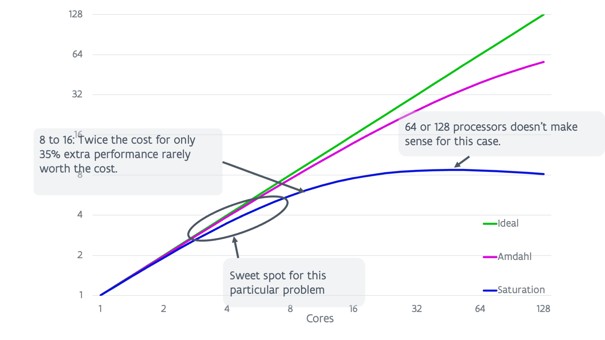

# Speed-up

Or: Using 100 processors should mean your job runs 100 times faster, right?

## Speed-up and efficiency

Success in running on a parallel computer is often measured by looking at
the speed-up, i.e., how much faster does a code run on *X* processors compared
to on the smaller number $Y$ processors, with $Y$ typically one? 
So in a mathematical formula, 

\[S(X,Y) = {T(Y) \over T(X)}\]

with $T(X)$ the time on
$X$ processors and $T(Y)$ the time on $Y$ processors. Ideally $Y = 1$ but in 
practice for big problems it is not feasible to measure $T(1)$ because
the problem doesn't fit in memory or simply takes too much time to run.

An alternative measure is the efficiency. When $Y=1$, the efficiency is simply
the speed-up divided by $X$, i.e., this would be $100%$ in the ideal case that
using $X$ processors also speeds up the computations with a factor of $X$.
The more general definition is

\[ \epsilon(X,Y) =  \frac{Y T(Y)}{X T(X)}, \]

i.e., the total time spent by all $Y$ processors (with $Y$ ideally 1) divided
by the total time spent by all $X$ processors.

## Amdahl's law and saturation

In the ideal case, running on $X$ processors instead of $1$ should make the application
$X$ times faster, but this is never the case. The graph below shows three scenarios.

<figure markdown>
  
  <caption>Ideal speed-up, Amdahl's law and saturation</caption>
</figure>

The top line shows the ideal speed-up. However, Amdahl noted already in
the late '60s that using parallelism would have its limitations as every program
will have some part that cannot be executed in parallel. Even if the parallel
section could be executed on an infinite number of processors, the total run time
would still be limited by that of the sequential part of the code. Assuming that
$99\%$ of the run time for a particular problem on one processor could be 
replaced by parallel code, then you could still never get a speed-up larger
than 100 as there is that $1\%$ of the runtime that cannot be eliminated. In fact,
in later papers there was even a formula derived for this:

\[S(X,1) = \frac{1}{(1-p) + \frac{p}{X}}.\]

This curve is shown as the magenta line in the graph.

In reality the situation is even worse. Amdahl's law does not take communication 
overhead into account. In practice, the more processors are used the larger
the relative communication overhead will become and this will lead to a saturation and
even a lowering of the speed-up at some point as the number of cores is further
increased. This is depicted in the lower line on the figure.

Amdahl's law already implies that whenever using parallel computing, one has 
to balance the cost of using more processors (as that cost will increase
due to the efficiency loss) with the gain from getting an answer quicker.
But this is even more pronounced in a more realistic situation.

<figure markdown>
  
  <caption>Ideal speed-up, Amdahl's law and saturation: Conclusions</caption>
</figure>

Looking at the blue curve (the lower one) in the above graph shows that it makes no sense
to even use 64 or 128 cores for this particular problem as the speed-up is lower than 
for roughly 32 cores (and hence the execution time higher). However, going from 8 to 16 
cores we also effectively gain only $35\%$ performance so one can wonder if this is worth
the cost. The sweet spot for this problem is probably somewhere between 4 and 8 cores.

## What does this mean?

Using $X$ times more processors will almost never speed up your application with a 
factor of $X$ as there is always some overhead in using more cores. 
There are some rare cases where this is not the case though and where you may see 
what is called a superlinear speed-up. This is due to cache effects. As you are using
more cores, the problem per core becomes smaller and as a consequence more of it may
fit into the caches, improving the performance of a core.

There is also no rule like program A runs best on $X$ processors. 
The optimal number of processors $X$ does not only depend on the application that you're
using. It also depends on the problem being solved. As we will see further in this
chapter, the bigger the problem, the higher the optimal number of cores.
Moreover, it also depends on the cluster: the characteristics of the CPU, the interconnect, ...,
all have an influence on the number of cores that can be used with reasonable efficiency.
In general, on supercomputers with a slower interconnect with less bandwidth or more
latency, fewer cores can be used for any given problem, even if those cores are the same
as on the computer with faster interconnect.

The general rule is though that bigger problems give you a better speed-up and efficiency
for a given number of cores, or let you use a larger number of processors for a given 
target efficiency.
