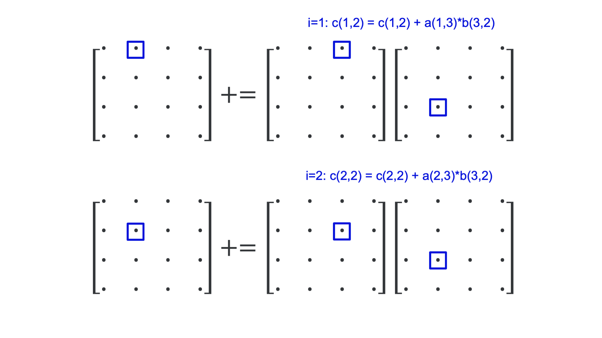
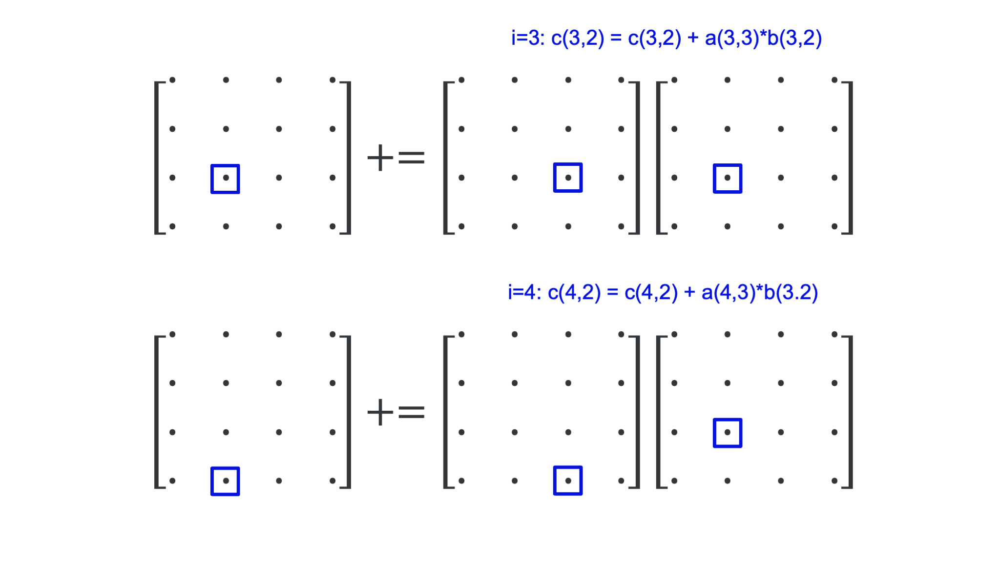
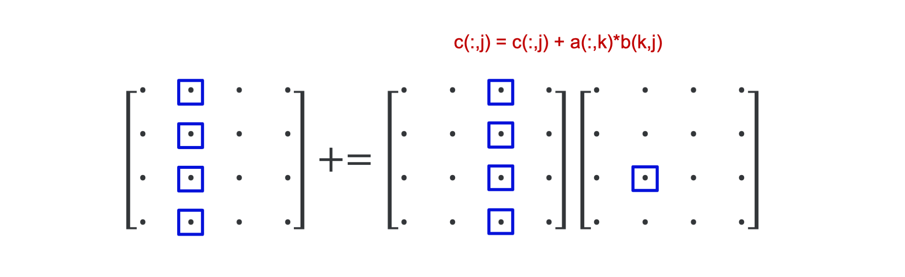
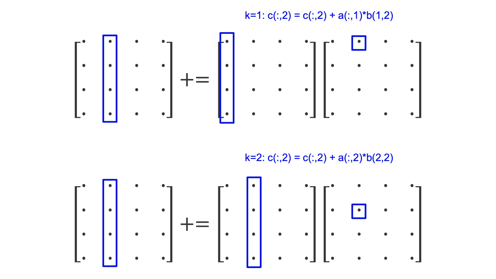
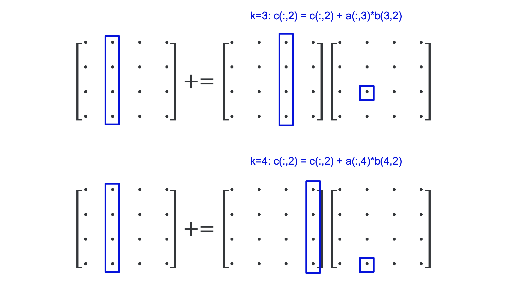

---
tags:
-   BLAS
---


# Illustration: Matrix-matrix multiplication

Let us illustrate the effect of the importance of optimising memory access patterns
and how good libraries can help us with a problem that seems simple: the multiplication
of two matrices (which we take square here to keep it as simple as possible).

The element $c_{i,j}$ on row $i$ and column $j$ of the product

$$ C \leftarrow C + A * B $$

is computed as 

$$ c_{i,j} \leftarrow c_{i,j} + \sum_{k=1}^N a_{i,k} b_{k,j}. $$

We can compute the new value of $C$ with this formula either row by row or column by
column. Computing row by row results in the following pseudo-code:

```
for i = 1 to N
	for j = 1 to N
		for k = 1 to N
			c(i,j) = c(i,j)+a(i,k)*b(k,j)
```

We'll call this the *ijk*-variant because of the order of the loop indices.

Computing the elements of $C$ column by column can be done with the following
pseudo-code:

```
for j = 1 to N
	for i = 1 to N
		for k = 1 to N
			c(i,j) = c(i,j)+a(i,k)*b(k,j)
```

which we call the *jik*-variant for obvious reasons.

The code for matrix-matrix multiplication has three nested loops. There are 6 
different permutations of the loop indices *i*, *j* and *k*, and all 6 result
in a correct program:

<table>
<body>
  <tr>
    <td style="text-align: center"><b>ijk</b></td>
    <td style="text-align: center"><b>jik</b></td>
  </tr>
    <td>
<pre><code>for i = 1 to N
  for j = 1 to N
    for k = 1 to N
      c(i,j) = c(i,j)+a(i,k)*b(k,j)
</code></pre>
    </td>
    <td>
<pre><code>for j = 1 to N
  for i = 1 to N
    for k = 1 to N
	  c(i,j) = c(i,j)+a(i,k)*b(k,j)
</code></pre>
    </td>
  </tr>
  <tr>
    <td style="text-align: center"><b>ikj</b></td>
    <td style="text-align: center"><b>jki</b></td>
  </tr>
    <td>
<pre><code>for i = 1 to N
  for k = 1 to N
    for j = 1 to N
      c(i,j) = c(i,j)+a(i,k)*b(k,j)
</code></pre>
    </td>
    <td>
<pre><code>for j = 1 to N
  for k = 1 to N
    for i = 1 to N
      c(i,j) = c(i,j)+ a(i,k)*b(k,j)
</code></pre>
    </td>
  </tr>
  <tr>
    <td style="text-align: center"><b>kij</b></td>
    <td style="text-align: center"><b>kji</b></td>
  </tr>
    <td>
<pre><code>for k = 1 to N
  for i = 1 to N
    for j = 1 to N
      c(i,j) = c(i,j)+ a(i,k)*b(k,j)
</code></pre>
    </td>
    <td>
<pre><code>for k = 1 to N
  for j = 1 to N
    for i = 1 to N
      c(i,j) = c(i,j)+ a(i,k)*b(k,j)
</code></pre>
    </td>
  </tr>
</body>
</table>

However, even though all 6 above variants are correct, it does not mean that
they will also perform the same..

## Timings of a Fortran implementation

The following table shows run times and the performance in Gflops derived
from the runtime and total number of operations for matrices of size
$N = 2500$, which require 47.4 MB of storage per matrix.
The runs were all done on a node of an older cluster with
Intel Xeon E5-2680v2 processors that can deliver a theoretical peak
performance of 22.4 Gflops at a clock speed of 2.8 GHz. 

The reason for taking this older cluster is that the caches are still relatively
small so that a smaller problem size can be used to demonstrate the effect of 
cache misses without having to go to such a large problem size that the run time
for the worst variants becomes prohibitively large to test easily.

The results are summarised in the following table:

| Variant                     | Time (s) | Gflops    |
|:----------------------------|---------:|----------:|
| *ijk*                       | 17.16    | 1.821     |
| *jik*                       | 24.35    | 1.283     |
| *ikj*                       | 63.68    | <span style="color:crimson;">**0.491**</span> |
| *jki*                       |  9.87    | <span style="color:green;">**3.165**</span>   |
| *kij*                       | 40.77    | 0.7666    | 
| *kji*                       | 13.29    | 2.352     |
| F95 MATMULT                 |  9.51    | 3.285     |
| OpenBLAS dgemm (1 thread)   |  1.27    | 14.60     |
| OpenBLAS dgemm (20 threads) |  0.08    | 396.42    |

The first 6 rows are the 6 variants of the matrix-matrix multiplication. 
We notice that none of the implementations is fast compared to the theoretical
speed of a core of this type. But the speed difference between the slowest and
fastest of those 6 variants is large: a factor of 6.5x. 

Fortran 95 has a built-in operation for matrix-matrix multiplication but in
this case the code doesn't really perform any better. 

OpenBLAS is a library of optimised routines for vector-vector, matrix-vector and
matrix-matrix operations, and dgemm is the name of the BLAS routine that does the
matrix-matrix multiplication that we need. We see immediately that we get a big boost
and a result that is even slightly better than the theoretical speed of the core at
the nominal frequency of 2.8 GHz. This is because the clock frequency on that node could
not be fixed and as we were using just a single thread, we got a slight boost of the
clock frequency. The result with OpenBLAS using one thread is 78.7x better than our best
simple variant. However, changing just an environment variable lets us run the code
using all 20 cores available on the node so without extra work we can even run at
close to 400 Gflops!


## Analysis of the *jki*-variant

Key to understanding the performance of the 6 variants is to realise that Fortran
stores matrices column by column (C does this row by row and in a C implementation
another variant would be the better one).

Let us first analyse what happens in the innermost loop of the $jki$-variant, which was
the best in the table:

```
for j = 1 to N
    for k = 1 to N
        for i = 1 to N
            c(i,j) = c(i,j)+ a(i,k)*b(k,j)
```

for $j = 2$ and $k = 3$. The figure below shows what happens in the 4 steps of the inner loop:

<figure markdown>
  
  
</figure>

We use only one element of $B$. The elements of both $A$ and $C$ are accessed
column-wise, i.e., in the order in which they are stored in memory. This is optimal
for cache use: When loading the first element, the cache will also load the next few
elements in that column (assuming that it would happen to be the first element of a
cache line). Typically, a cache will contain blocks of 64 bytes so 8 double precision
floating point numbers (the data format used in the tests). So for the second iteration
it is very likely that all the data needed is already in memory.

The effect of the innermost loop is best summarised by the following picture:

<figure markdown>
  
</figure>

The inner loop for the given values $j = 2$ and $k = 3$ takes the third column of $A$, which we
could consider a vector, multiplies it with the scalar element $b(2,3)$ on the third row and second
column of $B$ and adds that column vector to the second row of $C$. This vector interpretation is the
key to understand what happens in the middle loop.

Let us keep $j = 2$ but now iterate over the middle loop. Each iteration of the middle loop 
takes a column vector of $A$, multiplies it with an element of $B$ and adds it to a column
vector of $C$ as is shown in the following figure:

<figure markdown>
  
  
</figure>

The whole operation of the innermost two loops for $j = 2$ is depicted in the following figure:

<figure markdown>
  
</figure>

In all, executing the two innermost loops, we use only a single column of $B$ and $C$, but we 
do run through the whole matrix $A$, and would do so again in the next iteration of the outer
loop. If $N$ is large enough the leftmost part of the matrix $A$ will have been pushed out
of the cache before it is again needed in the next outer iteration, but we would be working
on a different set of elements of $B$ and $C$.


## But how can BLAS then even be faster?

BLAS stands for Basic Linear Algebra Subprograms and is a library that contains basic 
linear algebra building blocks used in other libraries such as Lapack 
(a library to solve dense linear systems and eigenvalue problems).
It was defined in three phases

-   BLAS 1 from 1979 defined a set of vector-vector operations to make it easier to
    exploit vector computers.
-   BLAS 2 extended that set in 1986 with matrix-vector operations. The extensions were
    triggered by the evolving needs to get a good performance on large computers, where
    exploiting only vector operations was not enough anymore and more care needed to 
    be taken of memory accesses too.
-   BLAS 3 extended BLAS in 1988 with matrix-matrix operations, that help to better exploit
    a cache hierarchy.

There is a [reference implementation of the BLAS API in Fortran](https://www.netlib.org/blas/), 
but that implementation doesn't
really give you a high performance. However, vendors of microprocessors invest a lot of time in
making an optimised implementation for their processors, and there are also a couple of open source
projects that did so. A popular closed source vendor implementation is the Intel MKL library
(which contains much more than just BLAS). The MKL routines are very well optimised for each
Intel processor, but not so much for competing compatible processors.
OpenBLAS and BLISS are two recent open source implementations.

The DGEMM code in an optimised BLAS library is a lot more complex than any of our six variants.
Optimised implementations work by splitting the matrices in small blocks that fit in cache
and compute the matrix-matrix product out of the matrix-matrix products of those smaller blocks.
Some libraries may even involve some assembler programming.

Blocking for cache reuse is a strategy used by many optimised libraries, also in other domains.


## A small surprise...

In the following table we repeated our experiment but now comparing the GNU Fortran compiler
to the Intel (classic) Fortran compiler:

| Variant                 |GNU Gflops | Intel Gflops                                |
|:------------------------|-----------|--------------------------------------------:|
| *ijk*                   | 1.821     | <span style="color:crimson;">1.60</span>    | 
| *jik*                   | 1.283     | <span style="color:darkviolet;">3.40</span> |
| *ikj*                   | 0.491     | <span style="color:crimson;">1.60</span>    |
| *jki*                   | 3.165     | <span style="color:darkviolet;">3.40</span> |
| *kij*                   | 0.7666    | <span style="color:green;">10.74</span>     |
| *kji*                   | 2.352     | <span style="color:green;">10.68</span>     |
| F95 MATMULT             | 3.285     | 10.97                                       |
| BLAS dgemm (1 thread)   | 14.60     | 24.75                                       |
| BLAS dgemm (20 threads) | 396.42    | 417,64                                      |

Not only does the Intel compiler in general produce better performance than the GNU compiler
for this code, with the fastest result being more than three times faster than the best
result with the GNU compiler (and another variant becoming the preferred one),
but we also notice that the performance is the same for pairs of variants. 
The $ijk$- and $ikj$-variants have the same performance, 
and so have the $jik$- and $jki$-variants, and the
$kij$- and $kji$-variants. What these variants have in common is that the first letter
is the same. The Intel compiler is sometimes capable of recognising a bad memory access
pattern and exchanging the order of the two innermost loops. We have seen this
happening in less trivial user code also. The fact that a different variant is now the
best one may be the result of the more powerful vectoriser in the Intel compiler
that may have found a better way to vectorise those particular variants.


## And on a machine with less cache memory...

Repeating the same experiment with the same matrix size on a 
laptop with far less cache than a cluster node shows an even
more interesting result:

| Variant                    | Time (s) | Gflops    |
|:---------------------------|---------:|----------:|
| *ijk*                      |  297.40  |   0.105   |
| *jik*                      |  295.53  |   0.106   |
| *ikj*                      | 1002.28  | <span style="color:crimson;">**0.031**</span> |
| *jki*                      |   11.67  | <span style="color:green;">**2.678**</span>   |
| *kij*                      | 1002.48  |   0.031   | 
| *kji*                      |   15.85  |   1.971   |
| F95 MATMULT                |   17.06  |   1.832   |
| OpenBLAS dgemm (1 thread)  |    3.42  |  29.979   |
| OpenBLAS dgemm (2 threads) |    1.80  |  57.349   |

The speed difference between the slowest and fastest of our 6 naive variants is
now already a factor of 86. And again we see a more than 10-fold increase 
from the best variant to a single-core run with a good BLAS library, and
a further near doubling of the performance when we also employed the second
core.
