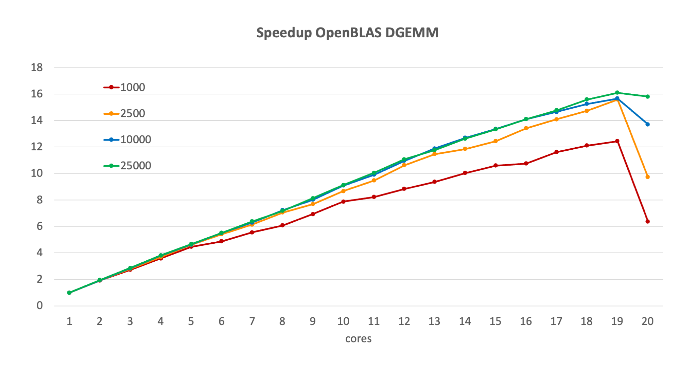
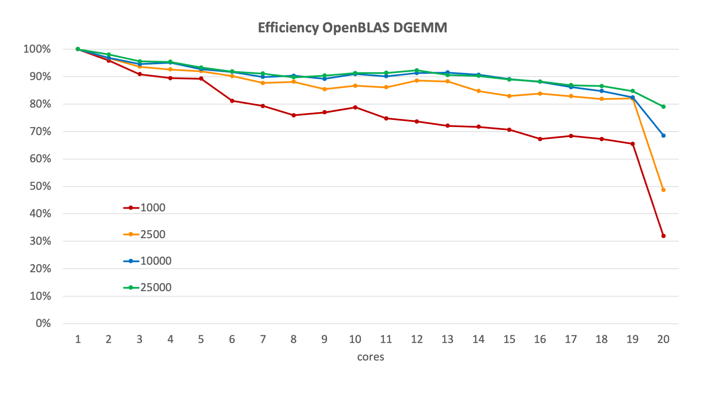
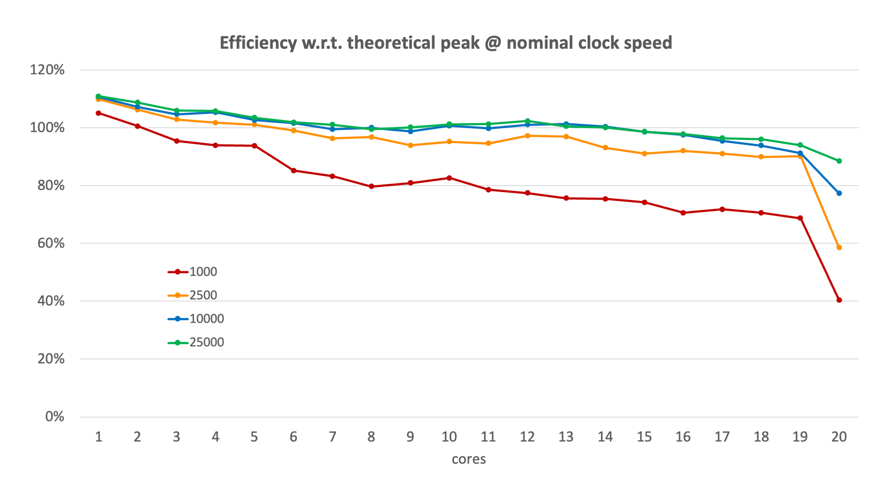

# Speed-up and efficiency of DGEMM

Let us use the OpenBLAS DGEMM routine from the previous section and see how it
behaves for different matrix sizes going from 1,000 to 25,000 and a different number
of cores. First we look at the speed-up which in this case where we can run on a single
core is defined as

$$ S(p) = \frac{T(1)}{T(p)} $$

with $p$ the number of cores.

<figure markdown>
  
  <caption>Speed-up of DGEMM for various matrix sizes</caption>
</figure>

As one would expect, the speed-up increases with a growing number of
cores, except for an anomaly on this specific machine when using all 20 cores which
was due to background work going on in the operating system.
For smaller core numbers the four lines are almost indistinguishable but 
as the number of cores increases we see that the speed-up is much better
for the larger matrix sizes, when there is more work per processor.

For this particular example we don't really see the flattening of the speed-up
or even lowering predicted for large core numbers in the model in the first
section of this chapter.

The ideal speed-up is of course equal to the number of processors used, but
this is more difficult to interpret in a graph. An easier number to work with
is the efficiency, which is the speed-up divided by the number of processors:

$$ \epsilon(p) = \frac{S(p)}{p} = \frac{T(1)}{p T(p)}.$$

Here the ideal would be 100%, i.e., a flat line independent of the number of cores.

For the same configuration as in the previous graph, we get

<figure markdown>
  
  <caption>Efficiency of DGEMM for various matrix sizes.</caption>
</figure>

We see that the efficiency decreases with increasing core numbers, and
for a given number of cores increases with the problem size. 
If we would put the limit for efficiency at 80%, we could only use 6 cores
for matrix size 1,000, but could use any number of cores in this
20-core node for the larger matrix sizes (neglecting for now the strange
behaviour when all cores are used).

However, to show how difficult benchmarking can be on a cluster where you cannot fix the clock
speed of a processor and can have turbo mode kick in, consider the following graph where we 
computed the efficiency based on the measured number of Gflops:

$$\epsilon(p) = \frac{G(p)}{pG_{theoretical}}$$

where $G(p)$ is the speed on $p$ processors and $G_{theoretical}$ is the theoretical peak
performance based on the nominal clock frequency of the node (22.4 Gflops at 2.8 GHz for this node).

<figure markdown>
  
</figure>

We now see that for all four matrix sizes the efficiency defined this way is higher than 100% on a single
core as the effective speed is higher because of the turbo boost. Bigger matrix sizes also benefit a little 
more which is not abnormal as the whole blocking strategy also comes with overhead that is partly a fixed
cost and shows more for the smaller problem. 

This just shows how difficult interpreting results from benchmarks is if there can be multiple factors
in play, like turbo boost, a load on part of the node when other users are also on the node, load
on the communication network from other users when benchmarking distributed memory code, ...

