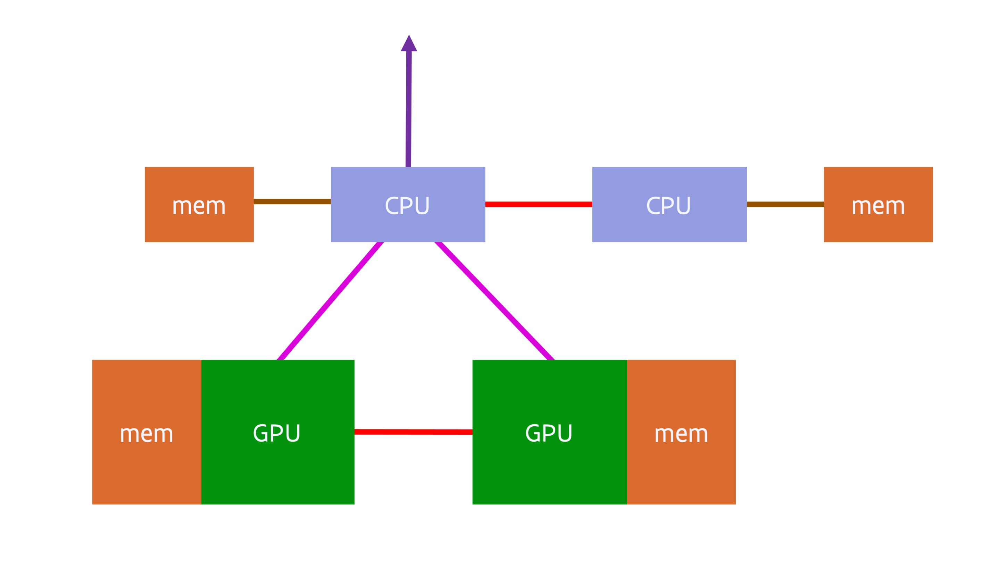
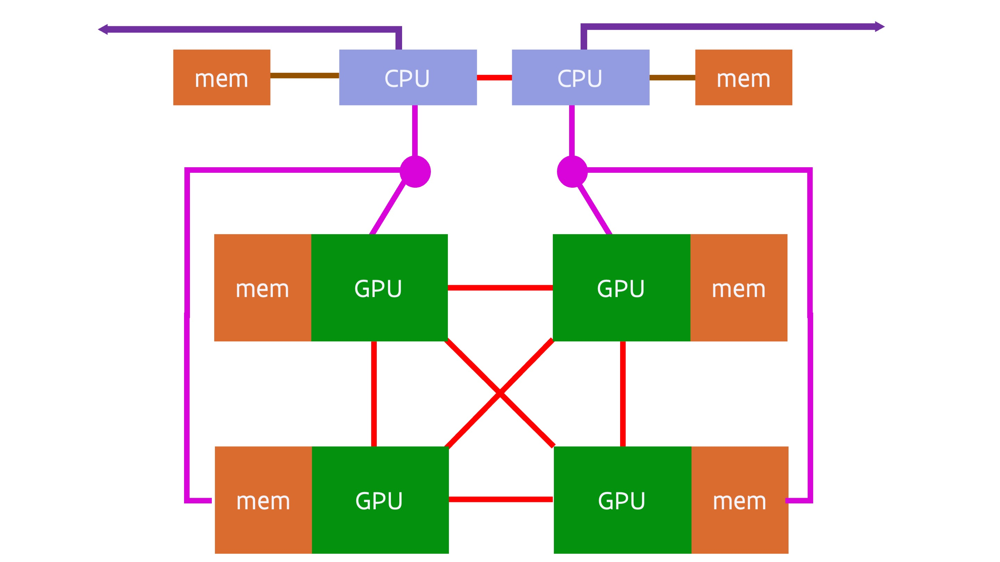
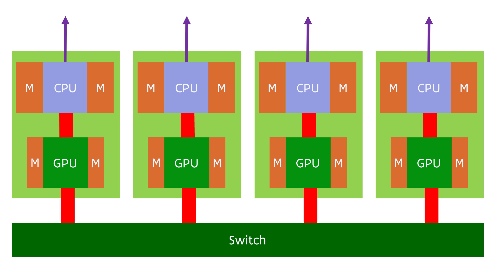

# Status of GPU computing

## Too much hype

Even though GPU computing, or accelerator computing in general, is definitely here to stay
and important for the future of not only supercomputing but computing in general as 
what can be done with a given amount of power is important in many markets
(also on mobiles that have to get their power from a battery), it does not mean that
it works for all applications.
Benchmarking of supercomputers with accelerators is often more benchmark*et*ing.
GPU computing is often overhyped using incomplete benchmarks (basically only benchmark
that part of the code that can be properly accelerated), marketing by numbers (redefine
common terms to get bigger numbers, something that in particular NVIDIA is very good
at) and comparing apples and oranges by comparing systems with a very different price
or total cost of ownership, e.g., comparing a server with multiple accelerators costing
60k EURO or more with a standard dual socket server costing only 10k EURO and using 
only one fifth of the power.

The NVIDIA vendor lock-in and its success in the market have made accelerators very 
expensive. At the current price point, GPU computing only makes sense from a price point
of view if the speed-up at the application level is a factor of 2.5 or more per accelerator card
compared to a standard medium-sized dual socket node.

As we have seen, some features of accelerators have been carried over to traditional CPUs 
in the form of new instructions supporting vector and nowadays even matrix computing, and 
in some cases they may just be the better choice as CPUs have more memory readily available
and as programming is easier.

## Problems and solutions

There are several problems with current GPU designs:

1.  The amount of memory that a GPU can address directly and has fast enough access to,
    is limited. 2020 GPUs were limited to 32-48 GB of memory, in early 2021 a 80 GB GPU
    appeared on the market, and in 2022 it is technically possible to have 128 GB on
    a single package. But this is still small to typical memory sizes on a regular dual
    socket server that is much slower than the GPU.

2.  Programming bottleneck: Having to organise all data transport manually and working with
    separate memory spaces is a pain.

3.  The link between the CPU and the GPU is a bottleneck. The PCIe buss that typically links the CPU to the GPU has 
    a rather limited bandwidth compared to either the bandwidth of the CPU memory of the bandwidth
    of GPU memory. 

4.  The GPU is rather slow for serial code, so that code often has to run on the host.
    Which is then an issue since it may require additional copying between the CPU and GPU.

However, there is hope.

The amount of memory that can be used by a GPU will increase a lot the coming years. Both the
memory packages are getting bigger by stacking more dies in 3D, and the number of memory packages
that can be integrated in the overall GPU package is increasing. As of 2022, 8 memory stacks in a
GPU package is feasible as is shown by the AMD MI250(X) GPUs, while in 2023-2024 12 memory stacks
in a single GPU package should become a possibility. The two combined may make memory sizes of 192 
and likely even 384 GB possible by 2024 or 2025.

The programming bottleneck can already be partially solved by unified memory, using memory pointers
that work on both CPU and GPU, and further hardware support for virtual memory that can then trigger
software that migrates memory pages under the hood. NVIDIA GPUs have had some of those features since
the Pascal generation in 2017. However, one can do even better by physically sharing memory spaces
between GPU and CPU, and supporting some level of coherency so that the CPU can access the GPU memory 
without risk of inconsistent data, or even the GPU can access the memory of the CPU, though that is less
interesting as the CPU can never provide the memory bandwidth that the GPU needs to perform well. 
NUMA style shared memory spaces were first explored in the Sierra and Summit USA pre-exascale
systems (as we discussed before) but is now also seen in the MI250X GPU from AMD which is a special 
version of the MI200 family connecting to the CPU through InfinityFabric, the same interconnect that AMD 
uses internally in its sockets to link the CPU dies to the I/O die, and also uses to connect CPU sockets
or to connect GPUs to each other in the MI100 and MI200 generations. 
The Intel Ponte Vecchio GPU combined with the Sapphire Rapids CPU that will be used in the Aurora supercomputer
supports a similar feature, as does the NVIDIA Grace CPU and Hopper GPU integrated in a single package.

The physical sharing of memory spaces with a level of cache coherency is also the first step in solving
the problem of copying data back and forth all the time. E.g., if a CPU can access memory attached to the 
GPU without risks of coherency problems, then there is less need to copy full memory pages and also not to 
copy those back, as the link that is used in those GPU systems to connect the CPU to GPU is as fast as the
links that are typically used to connect two CPU sockets. The NVIDIA Grace Hopper "superchip" shows the next 
step. By integrating the CPU and GPU in the same package, it is possible to have a much higher bandwidth
between both, reducing the copying bottleneck in cases where copying is still needed. 
However, with the AMD MI300 and Intel Falcon Shores and without doubt a future unannounced NVIDIA product,
we will see even closer integration where CPU and GPU chiplets share the memory controllers.
The Apple M series chips give an indication of what can be obtained with such a system, as 
these systems perform way better in some applications that use acceleration than one would expect from
looking at systems with discrete GPUs with similar theoretical performance.

We will discuss this evolution in some more detail in the next section.

## Evolution of GPU nodes

### GPU subsystem connected via PCIe

Around 2016, a typical GPU compute node consisted of a dual socket server with 1-4 GPUs attached
to the CPUs. A typical design would have been:

The red line between the two CPUs denotes a fully cache coherent link between the CPUs. 
In 2016 this would very likely have been either Intel CPUs or IBM POWER CPUs, and both
had proprietary fully cache coherent links to link CPUs in a shared memory system.
The red link between the GPUs denotes a similarly proprietary connection between the
CPUs for easy data transfer between the CPUs at typically a much higher bandwidth than
that offered by the connections between the CPU and GPU. However, not all systems used
such a link between graphics cards. A CPU was connected to the GPUs using PCIe, and
similarly a network interface would also be connected to a CPU using PCIe.

Later designs tried to move the network interconnect closer to the GPUs, as they
perform the majority of the calculations and hence also contain the data that should
be send to other nodes. A typical 4-GPU node based on the NVIDIA Ampere A100 GPU launched
in 2020 would look similar to:

There are many variants of quad GPU designs with the A100 GPU, with single and dual
socket CPU servers. However, it is often advantageous to have all GPUs connected to
a single CPU, but only the single socket AMD Epyc CPU has enough PCIe connections
to do so and still be able to also attach one or two network interface cards.
The above design solves this in a different way. It uses two PCIe switches (the magenta
circles), and each PCIe switch connects the CPU to two of the GPUs and a network 
interface card (the latter denoted by the dark purple line). This also brings the
network very close to the GPU. 

### Cache-coherent interconnect between CPU and GPU

The next evolution of this design is used in the USA pre-exascale systems
Sierra and Summit, both using IBM POWER9 CPUs and NVIDIA Volta V100 GPUs.
More recently, the idea is revived in the 
GPU compute nodes of the Frontier
and LUMI supercomputers based on the MI250X GPU. A simplified diagram of the
LUMI and Frontier GPU nodes is:

The GPU compute nodes of LUMI and Frontier use a special variant of the Zen3-based
AMD Epyc processor. In this variant, the PCIe lanes are replaced by InfinityFabric
connections. In an MI250X, the 4 GPU packages are connected with each other and with 
the CPU through Infinity Fabric links. Each GPU package connects to its own quarter of
the AMD Epyc processor (remember from earlier that the I/O die is subdivided in 4
quarters, in this case each connected to two CPU chiplets with 8 cores each).
This creates a coherent memory space. Also noteworthy is that the
interconnect is no longer connected to the CPU, but the 4 network cards are each
connected to a GPU package (through a PCIe interface). This makes this compute
node really a GPU-first system, almost a system where the CPU is only used for
those parts of the code that cannot be accelerated at all by a GPU and to run the 
Linux operating system.

The true picture of the MI250X GPU node is a bit more complicated though. Each GPU package
contains two GPU dies, and these are connected to each other through some Infinity Fabric
links. Each GPU die connects to 4 memory packages, with 64 GB of memory per GPU die.
However, the connection between two GPU dies is sufficiently bandwidth-starved that
programming wise a single GPU package should be considered as two separate GPUs. 
Each individual GPU die has its own InfinityFabric link to the CPU and seems to have a
preferential CPU chiplet. Even though the connection between the GPU packages appears to 
be an all-to-all connection, this is not true when one looks at the connections between
the GPU dies. 

### Integration of CPU and GPU in a single package: NVIDIA GH100

Even though the MI250X has a level of cache coherency, using the memory in a unified matter
is still a problem, partly because of the extra latency introduced by the fairly long distance
between the CPU and GPU, partly also because of the limited memory bandwidth on the CPU side.
NVIDIA's Grace Hopper Superchip, expected in 2023, works on those two problems by integrating
the CPU and GPU on a single package and not only putting the GPU memory, but also the
CPU memory on that package. 
The CPU part is called Grace and is a CPU based on the ARMv9 architecture, the newest
version of the ARM architecture at the time of design of the Grace processor.
The GPU part of the package is the Hopper architecture and similar to the one in the
SXM and PCIe cards released in the fall of 2022, but with all 6 memory controllers
enabled.

The CPU and GPU still both have their own memory controllers and basically behave as
separate NUMA domains, but as the connection between the two has been brought on-chip
the bandwidth between CPU and GPU is a lot higher than in the MI250X architecture
OR the Summit and Sierra systems with IBM POWER9 and NVIDIA V100 chips.
The CPU memory is not provided through external DIMMs, but through a number of internal 
LPDDR5X modules integrated in the CPU-GPU package in a similar way as the GPU memory has
been integrated in the package for a number of generations already. 
Integration of this memory type is popular in smartphones where it saves both space
and power, and is also used in the Apple Silicon M-series chips, where in addition to
space and power savings it also provides higher bandwidth. In the Grace chip it 
enables a very high memory bandwidth for the CPU, even 20% better than what the 
AMD EPYC 4 generation offers per socket (but not as much as the Intel Sapphire Rapids
MAX chips that incorporate a small amount of GPU-style memory in the package) while 
still offering a high memory capacity. Pre-release material claims up to 512 GB per CPU, 
but this number has to be taken with a grain of salt as it does not correspond to the
available memory modules that can be found in catalogues of memory providers in early
2023.

The Grace Hopper superchip provides two types of external connections. There are a number
of regular PCIe connections that come from the CPU die. They can be used to attach, e.g., network
cards (including a HPC interconnect) and NVMe drives.
There are also a number of NVLINK connections coming from the GPU die. These connections
are similar to the ones already used in previous generation NVIDIA GPUs to link GPU packages
and offer a much higher bandwidth interconnect. They can be used to interconnect a number
of Grace Hopper superchips in a NUMA shared memory way.

This makes the Grace Hopper superchip a very flexible building block.
Depending on the needs those chips can be combined in different ways. 
One can connect individual single package nodes through any HPC interconnect in a distributed
memory way. 
It is also possible to use NVLINK technology to connect multiple superchips into a single system
where each CPU and each GPU appears as a NUMA node to the OS. 
The bandwidth of this connection is much higher than the typical inter-socket interconnect in
CPU-based servers, but still a lot lower than the memory bandwidth that the GPU memory system can
offer. So it is very important that applications exploit the NUMA structure of the memory.
It is also possible to combine both approaches:
Build supercomputer nodes with up to 8 superchips with a single NVLINK switch level,
and link those nodes together using a traditional HPC interconnect. A possible layout of such a node 
is shown in the following figure:

In this figure we combine 4 Grace Hopper packages in a single node and have chose to connect each
package directly to the interconnect for additional bandwidth.

### Fully unified CPU and GPU: AMD MI300

The AMD MI250X is really just a transition to the MI300 series, 
that goes one step further beyond the integration
that the NVIDIA Grace Hopper architecture offers. 
In that generation, expected to come to market in
late 2023, the CPU and GPU
will merge completely and share on-package memory. 
In fact, the reality is that
memory outside the package is also starting to limit CPU performance as an increasing number
of CPU codes becomes memory bandwidth bound, so even for the CPU it makes sense to switch
to smaller but much higher bandwidth memory in the package. The AMD MI300 
will fully integrate the CPU and GPU chiplets and memory controllers with memory in a single
package. 
Whereas the MI250x has cache coherent memory but still a lot of overhead when the GPU wants to
access CPU memory or the other way around, in the MI300 generation the CPU and GPU memory
is fully unified (physical and virtual), with both sharing the same memory controllers and memory, which will enable
to fully eliminate redundant memory copies.
MI300 was first mentioned at the AMD Financial Analyst Day in June 2022 and at 
[CES'2023 (early January)](https://youtu.be/OMxU4BDIm4M?t=5382),
where a full package was shown, but still with very little detail.
It was announced the one MI300 package will combine a powerful GPU with 24 CPU cores 
(presumably 3 Zen4 chiplets) and 8 HBM3 modules for a total of 128 GB RAM. The chip
will consists of 13 chiplets stacked in two layers, with 4 chiplets at the bottom (presumably 
the memory controllers as they produce less heat) and 9 chiplets at the top 
(which could be 3 CPU chiplets and 6 CDNA3 GPU dies?). 
A supercomputer node based on this
chip could look a bit like

Here we see four packages integrating one or more CPU chiplets, one or more GPU dies and
memory in a single packages. The four packages have an all-to-all connection likely using
a new generation of InfinityFabric, and each GPU packages also connects to a network card
using PCIe. It is expected that the techniques to connect dies will have evolved enough
that the GPU dies in a single package will work as a single GPU. In fact, those improved
connections will also be needed to have equal access to memory from the GPU and CPU chiplets.

It does look though that the total memory capacity of such a node may be rather limited, unless
there would be some unannounced feature to attach slower external memory, e.g., through additional
DIMM slots or through (even slower) CXL memory boards. But for applications that don't need those
large memory capacities and scale nicely over NUMA domains and then further over distributed memory
nodes, the more uniform architecture will certainly make life easier and offer great performance
benefits.

Intel was also working on a similar design, code-named Falcon Shores that was intended to hit
the market in 2024, but in an announcement in March 2023 it was said that the chip was postponed
till 2025, and the announcement also mentioned it as a GPU, explicitly scrapping the XPU term they
used before.
